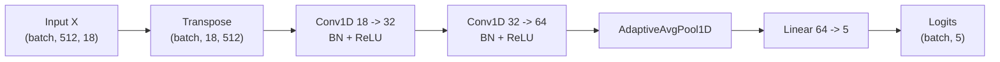
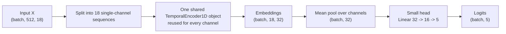
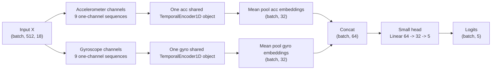
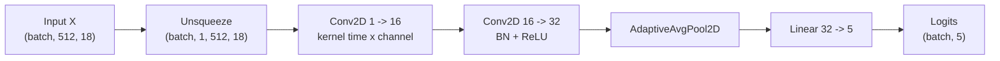

# Model Architecture Diagrams

## `all_channel_conv1d_v1`

이 모델은 18채널을 한 번에 입력받는다. 채널 간 결합을 Conv1D encoder 내부에서 자유롭게 학습한다.

## `channel_shared_meanpool_v2`

weight sharing은 `shared_encoder` 하나를 18개 channel에 반복 적용하는 지점에서 일어난다. channel별 encoder를 따로 만들지 않는다.

## `modality_shared_meanpool_v2`

acc encoder와 gyro encoder는 서로 다른 object이다. 각 modality 내부 channel은 해당 modality encoder 하나를 공유한다.

## `cnn2d_baseline_v1`

이 모델은 time x channel grid를 2D 입력처럼 다루는 baseline이다.
