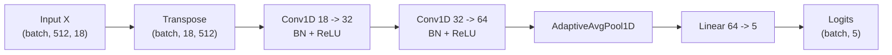
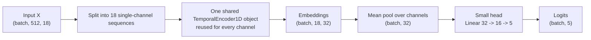
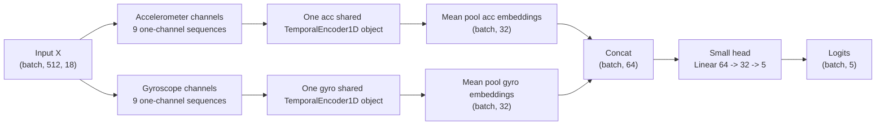
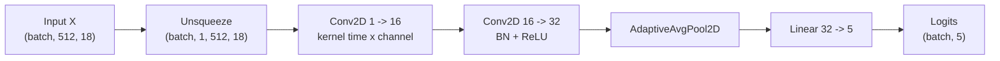
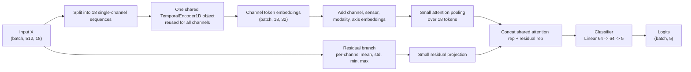
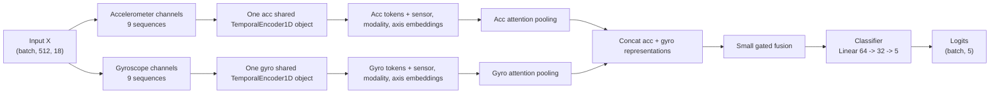

# Model Architecture Diagrams

Netron 기반 TorchScript 구조도와 PNG 캡처는 [Netron Model Visualization v1](netron_model_visualization.md)에 정리하였다. 해당 산출물은 `results/model_diagrams/netron_exports_v1/` 아래에 있으며, 학습된 checkpoint가 아닌 initialized architecture export이다.

## `all_channel_conv1d_v1`

이 모델은 18채널을 한 번에 입력받는다. 채널 간 결합을 Conv1D encoder 내부에서 자유롭게 학습한다.

## `channel_shared_meanpool_v2`

weight sharing은 `shared_encoder` 하나를 18개 channel에 반복 적용하는 지점에서 일어난다. channel별 encoder를 따로 만들지 않는다.

## `modality_shared_meanpool_v2`

acc encoder와 gyro encoder는 서로 다른 object이다. 각 modality 내부 channel은 해당 modality encoder 하나를 공유한다.

## `cnn2d_baseline_v1`

이 모델은 time x channel grid를 2D 입력처럼 다루는 baseline이다.

## `channel_shared_posres_attention_v3`

이 모델은 encoder weight sharing을 유지하면서 channel identity를 보존한다. residual branch는 shared encoder가 공통 feature를 학습하는 동안 channel별 raw summary 정보를 잃지 않도록 한다.

## `modality_shared_sensorattn_v3`

이 모델은 acc/gyro modality별 encoder를 분리하고, 각 modality 내부 channel을 sensor-aware attention으로 집계한다. 기존 mean pooling v2와 달리 modality별 token 중요도를 학습할 수 있다.
