# Professor Master Report - Full Story

관련 노트: [[architecture_explanation|Architecture Explanation]], [[Professor Master Report - 10min Brief|10min Brief]], [[Figure and Table Index|Figure and Table Index]]

## 0. Executive Summary

교수님 요구 실험은 수행되었다. 새 학습이나 CAU training 없이, lock된 결과와 이후 controlled comparison/XGBoost/literature/v3 ablation 산출물을 읽기 전용으로 통합했다.

핵심 결론은 **Residual Channel-Shared Feature Extractor가 naive shared encoder의 병목을 크게 완화했고, All-Channel 1D CNN 및 XGBoost/RF와 경쟁 가능한 수준까지 회복했다**는 것이다. 다만 Statistical Summary MLP가 가장 높은 Macro F1을 보였고 tree baselines도 강하므로, 논문 claim은 압도적 우월성이 아니라 **shared encoder bottleneck 완화와 controlled feature extractor comparison**으로 두는 것이 안전하다.

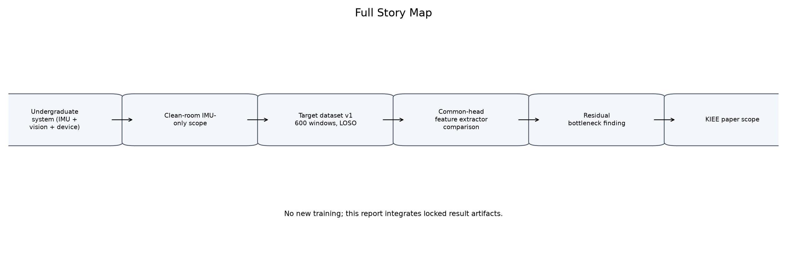

## 1. 연구 방향 전환: 학부 시스템 논문에서 저널용 IMU-only Architecture 논문으로

기존 졸업논문은 IMU, vision, on-device system을 함께 다루는 시스템 중심 성격이었다. 이번 저널 논문은 범위를 좁혀 IMU-only supervised squat posture classification과 feature extractor architecture comparison을 중심으로 구성한다.

| stage | question | action | evidence | takeaway |
| --- | --- | --- | --- | --- |
| From undergraduate system to journal scope | 기존 IMU+Vision+on-device 시스템을 그대로 논문 중심으로 둘 것인가? | 저널 논문 범위를 IMU-only supervised feature extractor comparison으로 축소했다. | 보고서 v1/v2/v3와 controlled comparison 결과 | 시스템 구현보다 clean-room protocol과 feature extractor 비교를 중심으로 설명한다. |
| Clean-room dataset reconstruction | raw/manual boundary 기반 target dataset을 재현 가능하게 만들 수 있는가? | raw CSV와 manually labeled boundary에서 512x18 processed dataset v1을 생성했다. | 600 windows, 6 subjects, 5 classes, NaN/Inf 없음 | 논문 실험은 새 clean-room pipeline에서 생성한 공식 target dataset을 사용한다. |
| Why common head comparison was needed | 모델별 head 차이가 feature extractor 효과를 가리는가? | 64-dim representation과 4,485-param common MLP head를 고정했다. | common head verification and controlled model parameter audit | 비교 초점은 classifier가 아니라 classifier 앞 feature extractor다. |
| Architecture comparison | shared encoder가 왜 낮았고 어떤 보완이 필요한가? | Shared 1D, identity, residual, all-channel, 2D, summary, tree baselines를 비교했다. | main controlled table and residual/identity interaction table | 단순 공유 구조는 병목이 크고 residual statistics가 이를 크게 완화한다. |
| Practical baselines | 간단한 통계 feature와 tree model이 얼마나 강한가? | Statistical Summary MLP, Random Forest, XGBoost, SVM을 같은 split/scaler policy로 평가했다. | Stats MLP 0.8174, XGBoost 0.7961, RF 0.7845 Macro F1 | summary statistics가 강한 dataset임을 투명하게 보고해야 한다. |
| Paper claim | 무엇을 안전하게 주장할 수 있는가? | 압도적 우월성이 아니라 shared encoder bottleneck 완화와 경쟁 가능성으로 claim을 보수화했다. | Residual branch effect and CI-overlapping strong baselines | 국내 저널 범위는 supervised IMU-only extractor comparison이 가장 안전하다. |

## 2. 교수님 피드백과 반영 현황

교수님 피드백의 핵심은 XGBoost, feature importance, normalization/scaler, model structure, 같은 classifier head, 1D/1D+residual/2D/MLP 비교였다. 이번 master report는 이를 하나의 실험 흐름으로 정리한다.

## 3. Dataset and Clean-room Protocol

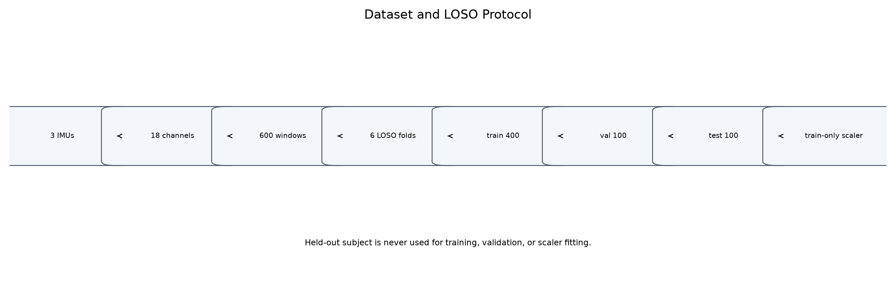

| item | value | note |
| --- | --- | --- |
| Sensors | 3 MPU-6050 IMUs | s0 lower back/waist, s1 right thigh, s2 right calf |
| Channels | 18 | accelerometer 3-axis + gyroscope 3-axis per IMU |
| Window length | 512 | phase-normalized linear interpolation from manually labeled boundaries |
| Samples | 600 windows | 6 subjects x 5 classes x 20 windows |
| Classes | 5 | Correct, Knee Valgus, Butt Wink, Excessive Lean, Partial Squat |
| Evaluation | LOSO with within-train stratified validation | held-out subject is test only |
| Fold size | train 400 / val 100 / test 100 | candidate training subjects: 16 train and 4 val windows per subject-class |
| Normalization | train-only StandardScaler | fit only on train indices, transform train/val/test |
| Disabled | per-window z-score, augmentation, focal loss, SSL, external transfer | not used in locked comparison |
| Leakage audit | passed | split and scaler audit passed in full experiments |

## 4. Normalization and Feature Extraction

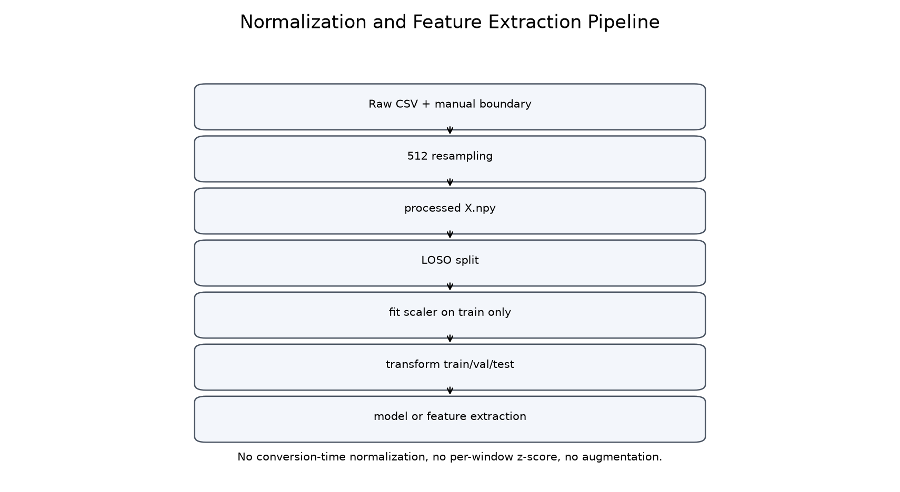

| step | operation | leakage_risk | current_policy | evidence |
| --- | --- | --- | --- | --- |
| Raw CSV + manual boundary | variable-length raw window extraction | boundary or label misuse | manual metadata is used only for window segmentation and labels | target conversion report |
| Conversion | linear phase interpolation to 512 | normalization before split | normalization none during conversion | conversion config and report |
| LOSO split | held-out subject test and within-train validation | test subject entering val/train | test subject never used in train/val/scaler | split and scaler audit |
| Scaler fit | StandardScaler fit | val/test distribution leak | fit on train indices only | scaler_fit_audit.csv |
| Feature extraction | neural residual/stat features or RF/XGBoost features | metadata-derived feature leakage | signal-derived features only after train-only scaling | feature_audit and code audit |
| Disabled operations | per-window z-score, augmentation, focal loss, SSL, external transfer | uncontrolled protocol changes | disabled in locked comparisons | configs and reports |

중요한 점은 dataset conversion 단계에서 normalization을 하지 않았고, fold 내부에서 train indices에만 StandardScaler를 fit했다는 것이다. Statistical Summary MLP와 residual branch는 train-scaled tensor에서 mean/std/min/max 72개 feature를 계산한다. RF/XGBoost는 같은 scaled signal에서 162개 signal-derived feature를 계산한다.

## 5. Why Common Head Was Needed

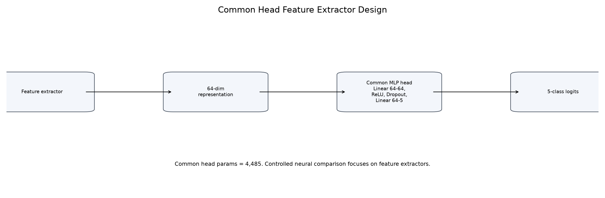

이전 모델 비교는 classifier head와 feature extractor가 함께 달라지는 confounder가 있었다. controlled comparison에서는 모든 controlled neural model이 64-dim representation을 만들고 동일한 4,485-param MLP head를 사용한다. 따라서 핵심 비교 대상은 classifier가 아니라 classifier 앞 feature extractor다.

## 6. Architecture Story

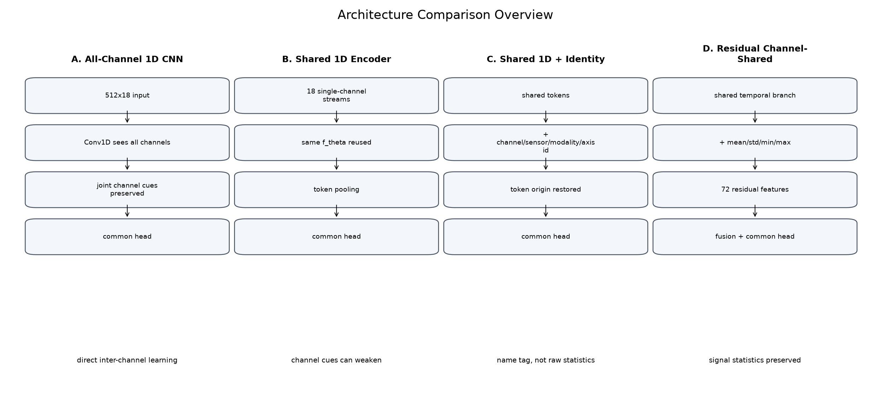

| model_display_name | family | input_handling | feature_extractor | classifier_head | parameters | role |
| --- | --- | --- | --- | --- | --- | --- |
| Statistical Summary MLP | Practical neural baseline | 512x18 scaled signal -> 72 statistics | mean/std/min/max projection | common MLP head | 9157 | small summary baseline |
| Residual Channel-Shared Feature Extractor | Proposed core | 18 single-channel streams + residual statistics | shared temporal encoder plus residual statistics branch | common MLP head | 20021 | shared bottleneck mitigation |
| All-Channel 1D CNN | Neural baseline | all 18 channels jointly | all-channel Conv1D | common MLP head | 20197 | strong joint-channel baseline |
| Shared 1D Encoder | Neural ablation | 18 single-channel streams | same temporal encoder reused then pooled | common MLP head | 7093 | shared-only failure reference |
| Shared 1D + Identity | Neural ablation | shared tokens plus identity embeddings | channel/sensor/modality/axis identity | common MLP head | 8885 | token origin ablation |
| 2D CNN | Neural baseline | time x channel matrix | 2D convolution | common MLP head | 14853 | time-channel image-like baseline |
| Random Forest | Practical tree baseline | 162 signal-derived features | hand-crafted feature extraction | Random Forest estimator | not_applicable | strong non-neural reference |
| XGBoost | Practical boosted tree baseline | 162 signal-derived features | hand-crafted feature extraction | XGBoost estimator | not_applicable | boosted tree reference |
| ResCNN-BiGRU-Attention | Literature reference | 512x18 sequence | Residual CNN + BiGRU + attention | model-specific head | 38934 | temporal literature baseline |
| Lee-style CNN-LSTM | Literature reference | internal 40-step downsampled time-channel matrix | 2D CNN + LSTM | model-specific head | 62637 | adapted CNN-LSTM reference |

### 6.1 All-Channel 1D CNN

18개 채널을 처음부터 함께 보는 강한 neural baseline이다. channel identity와 inter-channel relationship을 직접 학습할 수 있다.

### 6.2 Shared 1D Encoder

18개 channel을 single-channel stream으로 분리하고 같은 temporal encoder를 재사용한다. parameter sharing은 가능하지만 pooling 이후 channel origin과 channel-specific statistics가 약해질 수 있다.

### 6.3 Shared 1D + Identity

channel/sensor/modality/axis identity를 token에 더해 token origin을 알려준다. Shared 1D Encoder보다 개선됐지만 raw summary statistics를 직접 제공하지는 않는다.

### 6.4 Residual Channel-Shared Feature Extractor

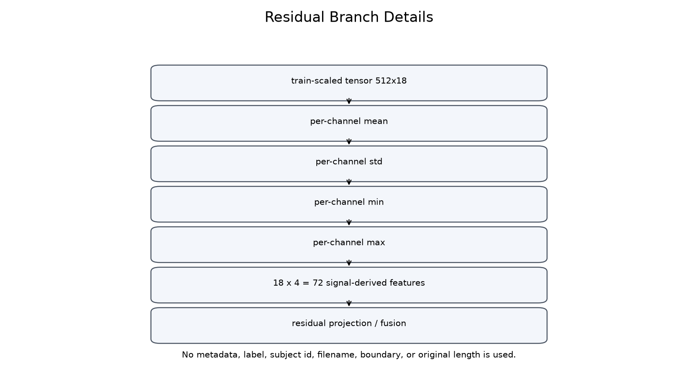

shared temporal branch와 residual statistics branch를 결합한다. residual branch는 train-scaled tensor에서 mean/std/min/max를 계산하여 18 x 4 = 72개 signal-derived feature를 제공한다. 이것이 proposed core다.

## 7. Main Results

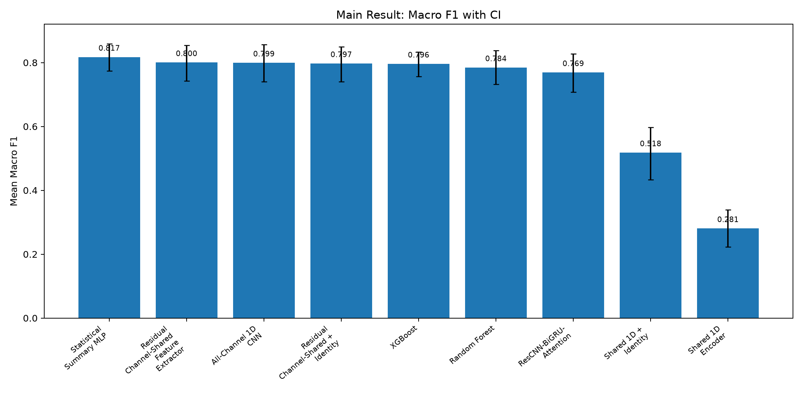

| rank | model_display_name | group | accuracy | macro_f1 | weighted_f1 | macro_f1_ci | role | safe_interpretation |
| --- | --- | --- | --- | --- | --- | --- | --- | --- |
| 1 | Statistical Summary MLP | Practical Baseline | 0.8250 | 0.8174 | 0.8174 | [0.7744, 0.8584] | summary-statistics upper practical reference | summary statistics alone are strong in this dataset. |
| 2 | Residual Channel-Shared Feature Extractor | Proposed Core | 0.8094 | 0.8004 | 0.8004 | [0.7423, 0.8540] | proposed core feature extractor | residual branch mitigates shared encoder bottleneck. |
| 3 | All-Channel 1D CNN | Neural Baseline | 0.8250 | 0.7994 | 0.7994 | [0.7404, 0.8564] | strong all-channel neural baseline | joint all-channel learning remains a strong baseline. |
| 4 | Residual Channel-Shared + Identity | Shared Encoder Ablation | 0.8072 | 0.7973 | 0.7973 | [0.7397, 0.8493] | residual plus identity ablation | identity adds little after residual statistics are present. |
| 5 | XGBoost | Practical Baseline | 0.8156 | 0.7961 | 0.7961 | [0.7567, 0.8328] | boosted tree practical baseline | strong practical baseline; do not overclaim neural superiority. |
| 6 | Random Forest | Practical Baseline | 0.8056 | 0.7845 | 0.7845 | [0.7318, 0.8376] | tree practical baseline | tree baseline confirms strength of hand-crafted signal features. |
| 7 | ResCNN-BiGRU-Attention | Literature Reference | 0.7944 | 0.7691 | 0.7691 | [0.7076, 0.8270] | literature temporal reference | temporal literature reference under same protocol. |
| 8 | Compact All-Channel 1D CNN | Neural Baseline | 0.7806 | 0.7562 | 0.7562 | [0.6786, 0.8242] | comparison model | reference result. |
| 9 | Linear SVM | Practical Baseline | 0.7461 | 0.7213 | 0.7213 | [0.6612, 0.7828] | comparison model | reference result. |
| 10 | Raw Flatten MLP | Neural Baseline | 0.7344 | 0.7046 | 0.7046 | [0.5953, 0.8074] | comparison model | reference result. |
| 11 | Lee-style CNN-LSTM | Literature Reference | 0.6622 | 0.6269 | 0.6269 | [0.5237, 0.7165] | comparison model | reference result. |
| 12 | Shared 1D + Identity | Shared Encoder Ablation | 0.5617 | 0.5182 | 0.5182 | [0.4335, 0.5968] | identity-only ablation | identity helps shared-only but is not sufficient. |

주요 수치는 Statistical Summary MLP 0.8174, Residual Channel-Shared Feature Extractor 0.8004, All-Channel 1D CNN 0.7994, XGBoost 0.7961, Random Forest 0.7845, Shared 1D Encoder 0.2806이다.

## 8. Residual vs Identity: Key Interaction

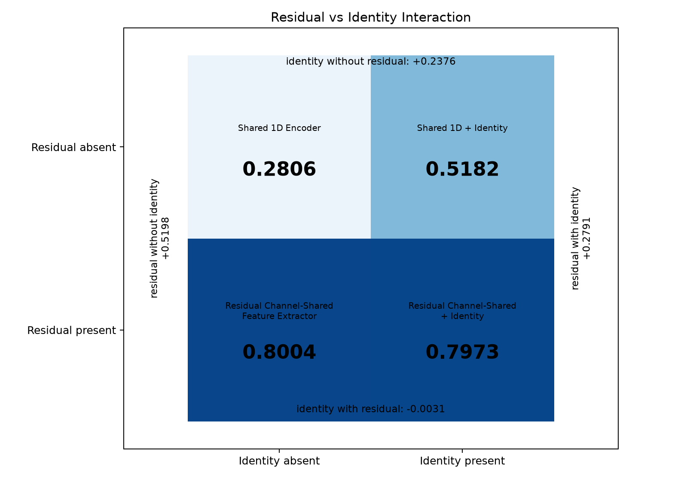

| residual_branch | identity_absent_model | identity_absent_macro_f1 | identity_present_model | identity_present_macro_f1 | identity_effect | interpretation |
| --- | --- | --- | --- | --- | --- | --- |
| Absent | Shared 1D Encoder | 0.2806 | Shared 1D + Identity | 0.5182 | +0.2376 | identity는 shared-only 구조에서 token origin 손실을 일부 보완한다. |
| Present | Residual Channel-Shared Feature Extractor | 0.8004 | Residual Channel-Shared + Identity | 0.7973 | -0.0031 | residual branch가 있으면 identity 추가 이득은 거의 없다. |

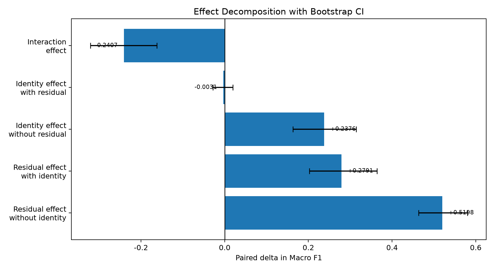

| effect_name | contrast | mean_delta | bootstrap_ci | n_pairs | interpretation |
| --- | --- | --- | --- | --- | --- |
| identity_effect_without_residual | Shared 1D + Identity - Shared 1D | 0.2376 | [0.1632, 0.3140] | 18 | Identity는 residual이 없을 때 token origin 손실을 일부 보완한다. |
| identity_effect_with_residual | Residual + Identity - Residual | -0.0031 | [-0.0284, 0.0193] | 18 | Residual branch가 들어간 뒤 identity 추가 이득은 거의 없거나 약간 음수다. |
| residual_effect_without_identity | Residual - Shared 1D | 0.5198 | [0.4637, 0.5799] | 18 | Residual branch는 shared-only 병목을 가장 크게 완화한다. |
| residual_effect_with_identity | Residual + Identity - Shared 1D + Identity | 0.2791 | [0.2022, 0.3641] | 18 | Identity가 있어도 residual branch의 추가 효과는 크다. |
| interaction_effect | (Residual+Identity - Residual) - (Identity - Shared) | -0.2407 | [-0.3211, -0.1620] | 18 | 음수 interaction은 residual branch가 identity embedding의 일부 역할을 대체했을 가능성을 시사한다. |

해석은 명확하다. identity는 이름표에 가깝고, residual branch는 signal statistics 자체를 제공한다. identity는 residual이 없을 때는 유용했지만, residual branch가 들어간 뒤에는 추가 이득이 거의 없었다.

## 9. Practical Baselines and Feature Importance

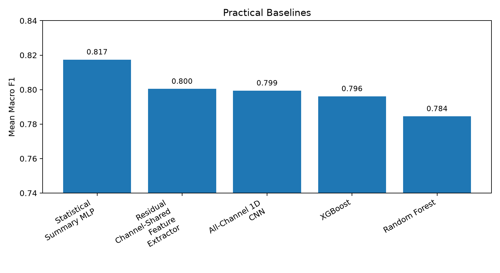

Statistical Summary MLP, Random Forest, XGBoost가 강하다는 점은 숨기면 안 된다. 이는 이 데이터셋에서 channel-wise summary statistics가 강한 signal임을 보여준다.

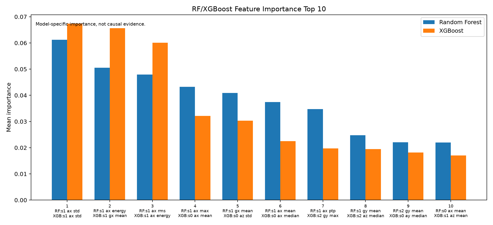

| rank | rf_feature | rf_importance | xgb_feature | xgb_importance | interpretation_note |
| --- | --- | --- | --- | --- | --- |
| 1 | s1_ax_std | 0.0612 | s1_ax_std | 0.0674 | 반복적으로 s1_ax/s1_gx 계열이 보이지만, feature importance는 causal evidence가 아니다. |
| 2 | s1_ax_energy | 0.0505 | s1_gx_mean | 0.0656 | 모델 내부 중요도이며 생체역학적 인과로 단정하지 않는다. |
| 3 | s1_ax_rms | 0.0479 | s1_ax_energy | 0.0601 | 모델 내부 중요도이며 생체역학적 인과로 단정하지 않는다. |
| 4 | s1_ax_max | 0.0432 | s0_ax_mean | 0.0321 | 모델 내부 중요도이며 생체역학적 인과로 단정하지 않는다. |
| 5 | s1_gx_mean | 0.0409 | s0_az_std | 0.0303 | 모델 내부 중요도이며 생체역학적 인과로 단정하지 않는다. |
| 6 | s1_ax_mean | 0.0374 | s0_ax_median | 0.0225 | 모델 내부 중요도이며 생체역학적 인과로 단정하지 않는다. |
| 7 | s1_ax_ptp | 0.0347 | s2_gy_max | 0.0197 | 모델 내부 중요도이며 생체역학적 인과로 단정하지 않는다. |
| 8 | s1_gy_mean | 0.0248 | s2_az_median | 0.0195 | 모델 내부 중요도이며 생체역학적 인과로 단정하지 않는다. |
| 9 | s2_gy_mean | 0.0221 | s0_ay_median | 0.0182 | 모델 내부 중요도이며 생체역학적 인과로 단정하지 않는다. |
| 10 | s0_ax_mean | 0.0220 | s1_az_mean | 0.0170 | 모델 내부 중요도이며 생체역학적 인과로 단정하지 않는다. |

s1_ax, s1_gx 관련 feature가 반복적으로 관찰되지만, feature importance는 model-specific importance일 뿐 causal evidence가 아니다.

## 10. Confusion Matrix and Class 3

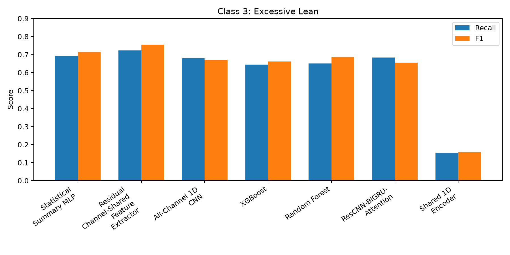

| model_display_name | class3_recall | class3_f1 | major_confusion_pattern | interpretation |
| --- | --- | --- | --- | --- |
| Statistical Summary MLP | 0.6917 | 0.7150 | Class 3 -> Butt Wink (48) | class-wise reference. |
| Residual Channel-Shared Feature Extractor | 0.7222 | 0.7542 | Class 3 -> Correct (55) | proposed core shows strong Class 3 result, but not a solved-class claim. |
| All-Channel 1D CNN | 0.6806 | 0.6692 | Class 3 -> Butt Wink (60) | class-wise reference. |
| XGBoost | 0.6444 | 0.6614 | Class 3 -> Correct (63) | tree practical baseline reference. |
| Random Forest | 0.6500 | 0.6848 | Class 3 -> Correct (50) | tree practical baseline reference. |
| ResCNN-BiGRU-Attention | 0.6833 | 0.6552 | not_available | class-wise reference. |
| Shared 1D Encoder | 0.1556 | 0.1573 | Class 3 -> Butt Wink (113) | shared-only failure pattern reference. |

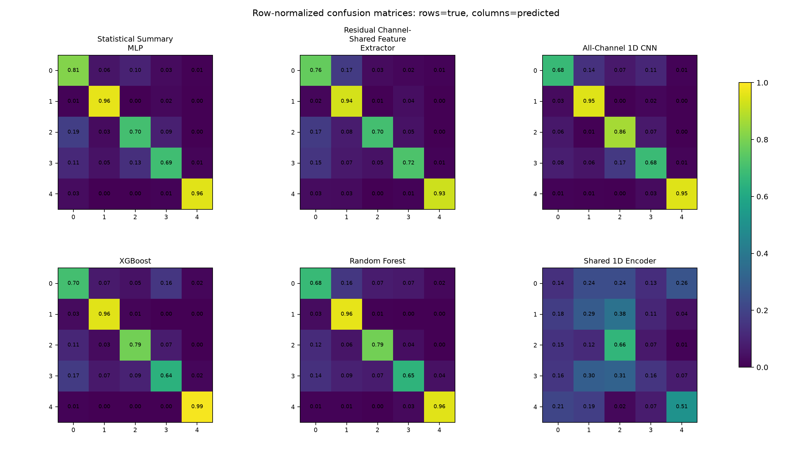

Confusion matrix는 행이 true class, 열이 predicted class다. Shared 1D Encoder의 failure pattern과 Class 3 Excessive Lean의 혼동 방향을 확인하는 진단용으로 사용한다.

## 11. Parameter Count and Capacity

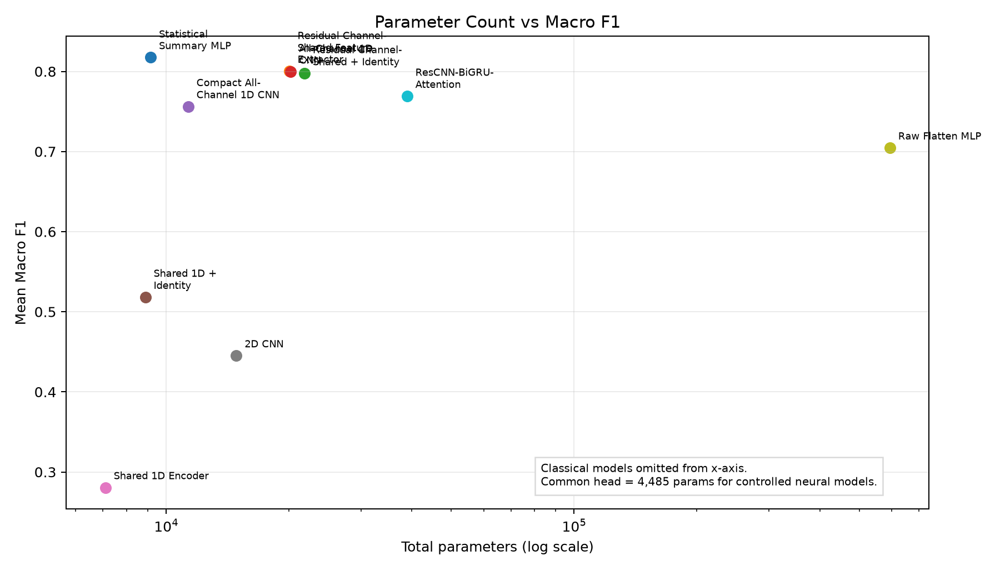

| model_display_name | total_params | extractor_params | common_head_params | macro_f1 | interpretation |
| --- | --- | --- | --- | --- | --- |
| Statistical Summary MLP | 9157 | 4672 | 4485 | 0.8174 | small summary-statistics neural baseline. |
| Residual Channel-Shared Feature Extractor | 20021 | 15536 | 4485 | 0.8004 | moderate-size proposed extractor with residual statistics. |
| Residual Channel-Shared + Identity | 21813 | 17328 | 4485 | 0.7973 | controlled neural comparison model. |
| All-Channel 1D CNN | 20197 | 15712 | 4485 | 0.7994 | controlled neural comparison model. |
| Compact All-Channel 1D CNN | 11317 | 6832 | 4485 | 0.7562 | controlled neural comparison model. |
| Shared 1D + Identity | 8885 | 4400 | 4485 | 0.5182 | controlled neural comparison model. |
| Shared 1D Encoder | 7093 | 2608 | 4485 | 0.2806 | controlled neural comparison model. |
| 2D CNN | 14853 | 10368 | 4485 | 0.4452 | controlled neural comparison model. |
| Raw Flatten MLP | 594373 | 589888 | 4485 | 0.7046 | parameter count is high but not best performing. |
| XGBoost | not_applicable | not_applicable | not_applicable | 0.7961 | classical estimator; neural parameter count is not comparable. |
| Random Forest | not_applicable | not_applicable | not_applicable | 0.7845 | classical estimator; neural parameter count is not comparable. |
| ResCNN-BiGRU-Attention | 38934 |  | not_applicable | 0.7691 | literature/reference temporal model; head is not common-head controlled. |

Parameter count와 성능은 단순 비례하지 않았다. Raw Flatten MLP는 매우 크지만 최고 성능은 아니며, classical models는 neural parameter count와 직접 비교하지 않는다.

## 12. What This Means for the Paper

| claim | status | rationale | safe_wording |
| --- | --- | --- | --- |
| Residual branch mitigates shared encoder bottleneck. | safe | Shared 1D Encoder 0.2806에서 Residual Channel-Shared Feature Extractor 0.8004로 크게 증가했다. | 잔차 branch는 naive shared encoder의 정보 병목을 크게 완화했다. |
| Residual Channel-Shared Feature Extractor is competitive with All-Channel CNN and tree baselines. | safe | Residual Channel-Shared 0.8004, All-Channel 1D CNN 0.7994, XGBoost 0.7961, RF 0.7845로 근접했다. | 강한 neural/practical baseline과 경쟁 가능한 성능을 보였다. |
| The proposed method is statistically superior to all baselines. | avoid | Statistical Summary MLP가 0.8174로 가장 높고, 주요 모델 간 CI overlap 가능성이 있다. | 최고 또는 유의한 우월성 대신 경쟁 가능성과 병목 완화로 서술한다. |
| Identity embedding is the core contribution. | avoid | identity는 residual이 없을 때 +0.2376이지만 residual 이후 -0.0031이다. | identity는 shared-only 구조에서 보완 효과가 있었고, core contribution은 residual branch다. |
| Attention-centered novelty. | avoid | 현재 종합 story의 핵심 효과는 residual statistics branch에서 나온다. | attention은 token aggregation 구현 요소로 낮춘다. |
| Feature importance as biomechanical proof. | avoid | RF/XGBoost importance는 model-specific statistic이며 causal evidence로 해석하지 않는다. | 특정 thigh-axis feature가 반복적으로 중요하게 관찰되었다고 제한적으로 말한다. |
| Transfer learning or external generalization is validated. | avoid | 이번 lock된 범위에는 SSL/external dataset experiment가 없다. | 후속 연구 또는 future work로 남긴다. |
| Summary statistics are strong for this dataset. | safe | Statistical Summary MLP, RF/XGBoost, residual branch가 모두 높은 성능을 보였다. | 이 데이터셋에서는 channel-wise summary statistics가 강한 signal로 관찰되었다. |

안전한 claim은 residual branch가 shared encoder bottleneck을 완화했고, proposed extractor가 강한 neural/practical baseline과 경쟁 가능하다는 것이다. 피해야 할 claim은 모든 baseline 대비 통계적 우월성, identity/attention 중심 claim, transfer learning 검증, feature importance의 인과 해석이다.

## 13. Recommended KIEE Scope

| item | include_in_kiee | reason | future_work |
| --- | --- | --- | --- |
| IMU-only supervised squat posture classification | yes | 현재 결과와 protocol이 가장 완성되어 있다. |  |
| Clean-room target dataset conversion | yes | 논문 실험 재현성과 데이터 누수 방지의 기반이다. |  |
| LOSO with train-only StandardScaler | yes | subject-independent 평가와 leakage control의 핵심이다. |  |
| Common-head feature extractor comparison | yes | 교수님 피드백에 직접 대응하고 architecture claim을 정리한다. |  |
| Residual branch and identity interaction | yes | 왜 residual을 proposed core로 둘 수 있는지 설명한다. |  |
| RF/XGBoost/Statistical Summary MLP baselines | yes | practical baseline이 강한 점을 투명하게 보고해야 한다. |  |
| Class 3 Excessive Lean analysis | maybe | 모델별 차이를 보여주는 보조 분석으로 유용하다. | 본문 공간에 따라 appendix 배치 가능 |
| Vision pipeline and on-device system | no | 이번 architecture 논문 main contribution을 흐릴 수 있다. | 시스템 논문 또는 appendix background |
| SSL and external dataset transfer | no | 현재 supervised paper의 검증 범위를 넘는다. | 후속 국제 논문 후보 |
| Real-time deployment claim | no | 현재 수치의 핵심은 LOSO supervised offline evaluation이다. | 응용 시스템 확장 |

## 14. Professor Discussion Script

### 3-minute version

1. 기존 시스템 논문 범위를 줄여 IMU-only supervised feature extractor comparison으로 재구성했다.
2. 데이터는 3 IMU, 18채널, 600 window이며 LOSO와 train-only scaler로 누수를 통제했다.
3. 같은 classifier head를 고정하니 Shared 1D 단독은 낮았고 residual branch가 성능을 크게 회복했다.
4. Statistical Summary MLP와 XGBoost/RF도 강해, claim은 압도적 우월성이 아니라 residual branch의 bottleneck 완화로 잡는 것이 안전하다.
5. KIEE에서는 supervised IMU-only architecture comparison으로 범위를 확정하는 것을 제안한다.

### 10-minute version

1. Scope change: IMU+Vision system에서 IMU-only architecture paper로 전환.
2. Dataset/protocol: 3 IMU, 18 channels, 600 windows, LOSO, train-only scaler.
3. Common head: 모든 controlled neural model은 64-dim representation과 동일 MLP head.
4. Architecture: all-channel, shared-only, identity, residual shared, 2D, summary/tree baselines.
5. Main result: residual shared는 All-Channel 1D CNN/XGBoost/RF와 근접.
6. Interaction: identity는 shared-only에 도움, residual 이후 추가 이득은 작음.
7. Interpretation: residual branch가 channel-wise statistics를 보존해 shared bottleneck을 완화.
8. Scope: KIEE에는 controlled comparison과 leakage-safe protocol을 중심으로 제안.

## 15. Questions for Professor

1. 제안 구조명을 `Residual Channel-Shared Feature Extractor`로 확정해도 되는가?
2. Statistical Summary MLP가 1위인 점을 main result에 넣을지 practical baseline으로 분리할지?
3. identity/position encoding은 future work 또는 appendix로 낮춰도 되는가?
4. RF/XGBoost는 main comparison table에 넣을지 practical baseline table로 분리할지?
5. 대한전기학회 제출 범위를 supervised IMU-only classification으로 확정해도 되는가?

## Appendix A. Detailed Tables

상세 CSV는 `tables/` 폴더에 있다. Figure caption은 [[figure_captions|figure_captions]]에 정리했다.

## Appendix B. Internal Name Mapping

내부 실험명은 `tables/table_internal_name_mapping.csv`와 `display_name_mapping.yaml`에서만 확인한다. 본문과 figure/table display에는 보고용 이름만 사용한다.

## Appendix C. Execution and Reproducibility

- 새 학습 실행: no
- CAU training 실행: no
- optimizer step/backward/epoch training: no
- 기존 result directory: read-only input으로만 사용
- source result paths:
  - feature extractor comparison result directory, timestamp `20260629_041712`
  - `results/xgboost_only_completion/20260629_053235_xgboost_only_completion_v1/`
  - `results/literature_baseline_full_extension/20260617_183952_literature_baseline_full_extension_v1/`
  - `results/v3_component_ablation/20260617_202714_v3_component_ablation_v1/`
  - `results/full_supervised_matrix/20260617_144309_full_supervised_matrix_v1/`
