# Residual Channel-Shared Encoder 보고자료

## 0. 한 줄 결론

교수님께서 요구한 **동일 classifier head 기반 feature extractor 비교와 XGBoost 보완 비교는 수행되었다.** 결과상 residual branch는 shared encoder의 병목을 크게 완화했지만, statistical summary 및 tree 기반 baseline도 강했다. 따라서 논문 주장은 “압도적 우월성”이 아니라 **잔차 채널 공유 구조가 naive shared encoder 문제를 완화하고 강한 baseline과 경쟁 가능한 성능을 보였다는 검증**으로 잡는 것이 안전하다.

## 1. 교수님 피드백 반영 요약

| professor_request | executed | evidence | note |
| --- | --- | --- | --- |
| XGBoost 비교 | yes | xgboost_only_completion_v1 | 동일 feature set, 18 runs 완료 |
| RandomForest feature importance 확인 | yes | random_forest_feature_importance_aggregate.csv | s1_ax 관련 feature 반복 관찰 |
| normalization/scaler 확인 | yes | scaler_fit_audit.csv | train indices only |
| 같은 classifier head 비교 | yes | common_head_verification.csv | 64-dim representation + 동일 MLP head |
| 1D / residual / 2D / MLP 비교 | yes | controlled comparison | display name table로 정리 |
| 국내 저널 범위 축소 | yes | table_09_final_recommended_scope.csv | SSL/transfer는 후속 연구로 분리 |

## 2. 데이터셋 및 평가 프로토콜

데이터는 3개 MPU-6050 IMU로 수집한 18채널 squat 자세 window다. 센서 위치는 허리, 오른쪽 허벅지, 오른쪽 종아리이며 각 센서는 accelerometer 3축과 gyroscope 3축을 제공한다. Raw window는 512 time steps로 phase-normalized linear interpolation을 적용해 정렬했다.

평가는 6명 subject에 대한 LOSO 방식이다. 각 fold에서 test subject 1명은 완전히 held-out이고, 나머지 5명의 각 subject-class 조합에서 16개 window를 train, 4개 window를 validation으로 사용했다. fold당 train 400, validation 100, test 100이며 StandardScaler는 train indices에만 fit했다.

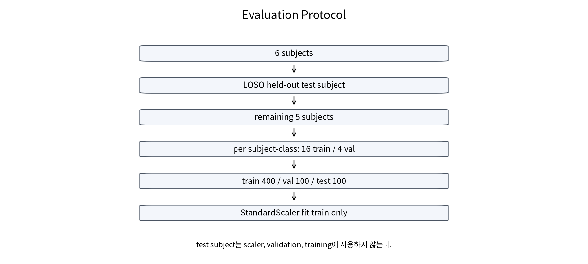

## 3. 왜 기존 결과만으로 부족했는가

기존 full matrix는 모델마다 classifier head와 representation pathway가 달라 feature extractor 자체의 효과를 분리하기 어려웠다. 이번 controlled comparison에서는 모든 neural model이 64차원 representation을 만들고 동일한 MLP head를 사용하도록 고정했다. 이 설계로 “앞단 feature extractor가 바뀌었을 때 성능이 어떻게 변하는가”를 더 직접적으로 볼 수 있다.

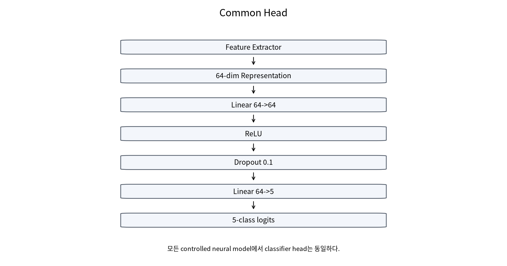

## 4. 비교한 아키텍처 구조

### 4.1 Statistical Summary MLP

Statistical Summary MLP는 512x18 IMU signal에서 channel별 mean, std, energy 등 signal-derived summary statistics만 계산한 뒤 64차원 representation과 공통 MLP head를 사용한다. 현재 데이터에서는 이 요약 통계가 매우 강한 baseline으로 나타났다.

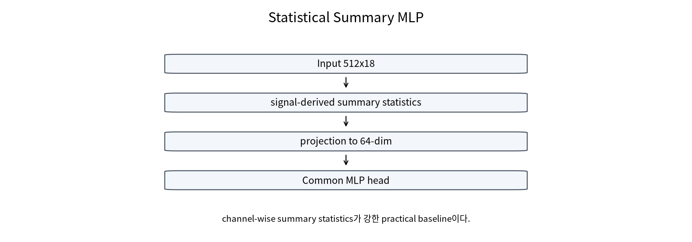

### 4.2 All-Channel 1D CNN

All-Channel 1D CNN은 18채널을 처음부터 함께 보고 temporal convolution을 학습한다. 채널 위치와 상호작용을 직접 학습할 수 있지만, 작은 subject 수에서는 자유도가 커질 수 있다.

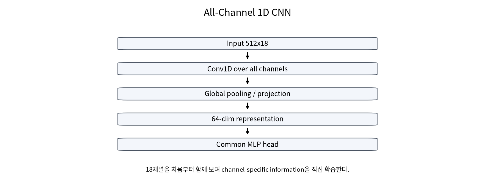

### 4.3 Shared 1D Encoder

Shared 1D Encoder는 18개 단일 채널 stream에 같은 temporal encoder를 재사용한다. parameter sharing은 가능하지만 channel identity와 위치별 차이가 약해질 수 있다.

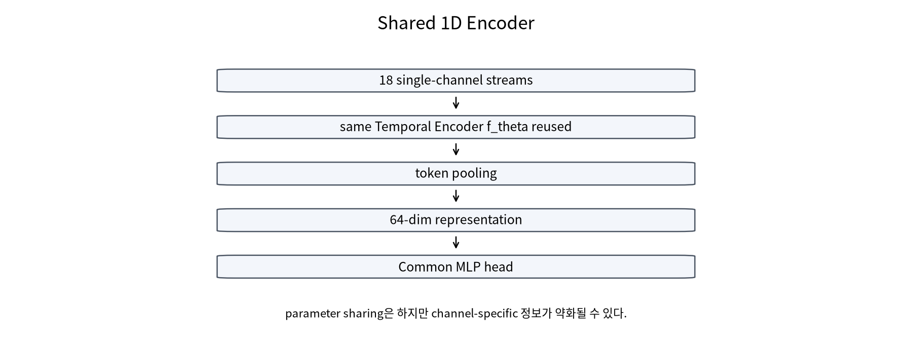

### 4.4 Residual Channel-Shared Encoder

Residual Channel-Shared Encoder는 shared temporal encoder를 유지하면서 raw IMU signal에서 나온 residual statistical branch를 병렬로 결합한다. 이 branch가 shared encoder가 잃을 수 있는 channel-specific summary signal을 보완한다.

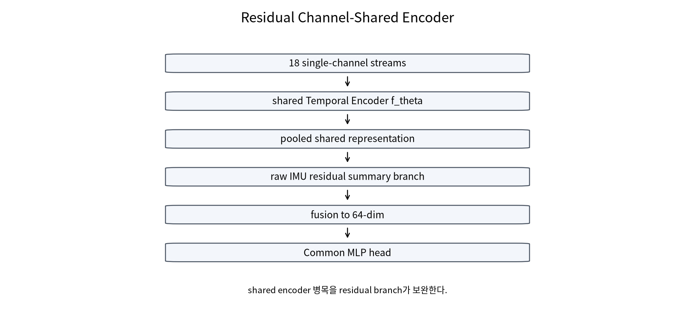

### 4.5 2D CNN

2D CNN은 time x channel matrix로 입력을 보고 2D convolution을 적용하는 baseline이다. 이번 controlled comparison에서는 상위 baseline보다 낮게 나타났다.

### 4.6 RF/XGBoost/SVM

Random Forest, XGBoost, Linear SVM은 동일한 signal-derived summary feature set을 사용한다. feature audit에서 metadata, label, subject ID, boundary, original length feature는 포함되지 않았다.

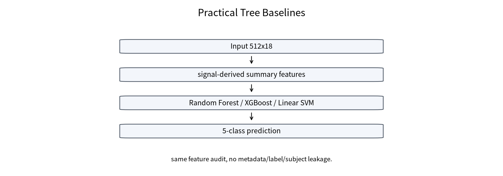

## 5. Controlled Feature Extractor 결과

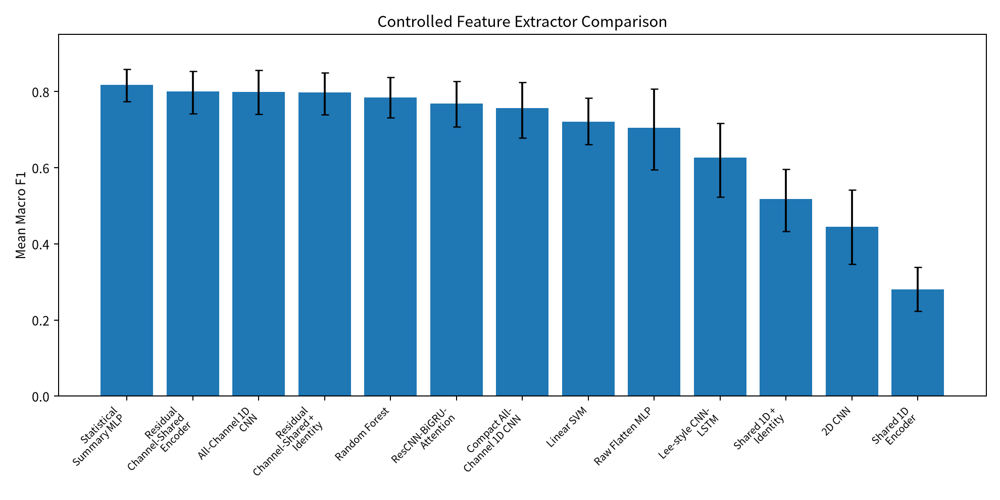

| model_display_name | group | accuracy | macro_f1 | weighted_f1 | macro_f1_ci | role | interpretation |
| --- | --- | --- | --- | --- | --- | --- | --- |
| Statistical Summary MLP | Practical Baseline | 0.8250 | 0.8174 | 0.8174 | [0.7744, 0.8584] | summary-statistics practical baseline | 현재 데이터에서 signal summary가 매우 강함. |
| Residual Channel-Shared Encoder | Proposed Core | 0.8094 | 0.8004 | 0.8004 | [0.7423, 0.8540] | proposed core extractor | shared encoder 병목을 residual branch가 완화. |
| All-Channel 1D CNN | Neural Baseline | 0.8250 | 0.7994 | 0.7994 | [0.7404, 0.8564] | all-channel neural baseline | 채널별 정보를 직접 학습하는 강한 neural baseline. |
| Residual Channel-Shared + Identity | Neural Baseline | 0.8072 | 0.7973 | 0.7973 | [0.7397, 0.8493] | residual plus identity variant | residual-only와 비슷해 identity 추가 이득은 제한적. |
| Random Forest | Practical Baseline | 0.8056 | 0.7845 | 0.7845 | [0.7318, 0.8376] | tree-based practical baseline | feature baseline이 강하다는 점을 확인. |
| ResCNN-BiGRU-Attention | Literature Reference | 0.7944 | 0.7691 | 0.7691 | [0.7076, 0.8270] | literature temporal reference | 문헌형 temporal reference로 비교 가능. |
| Compact All-Channel 1D CNN | Neural Baseline | 0.7806 | 0.7562 | 0.7562 | [0.6786, 0.8242] | comparison model | 비교용 모델. |
| Linear SVM | Practical Baseline | 0.7461 | 0.7213 | 0.7213 | [0.6612, 0.7828] | comparison model | linear feature baseline으로 lower bound 역할. |
| Raw Flatten MLP | Neural Baseline | 0.7344 | 0.7046 | 0.7046 | [0.5953, 0.8074] | comparison model | 큰 parameter 수에도 inductive bias가 약함. |
| Lee-style CNN-LSTM | Literature Reference | 0.6622 | 0.6269 | 0.6269 | [0.5237, 0.7165] | adapted CNN-LSTM reference | adapted CNN-LSTM은 본 protocol에서 낮음. |
| Shared 1D + Identity | Neural Baseline | 0.5617 | 0.5182 | 0.5182 | [0.4335, 0.5968] | comparison model | identity만으로는 병목 해결이 부족. |
| 2D CNN | Neural Baseline | 0.5056 | 0.4452 | 0.4452 | [0.3472, 0.5413] | comparison model | time-channel 2D baseline은 낮게 관찰. |
| Shared 1D Encoder | Neural Baseline | 0.3500 | 0.2806 | 0.2806 | [0.2233, 0.3385] | comparison model | 단독 shared pooling은 underfit. |

핵심은 세 가지다. 첫째, Statistical Summary MLP가 가장 높다. 둘째, Residual Channel-Shared Encoder는 All-Channel 1D CNN과 매우 가까운 Macro F1을 보인다. 셋째, Shared 1D Encoder 단독은 낮아서 단순 parameter sharing만으로는 충분하지 않다.

## 6. Residual branch 효과

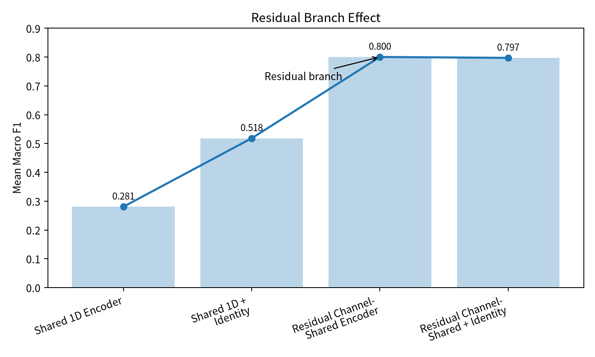

| model_display_name | macro_f1 | delta_from_shared_1d | meaning |
| --- | --- | --- | --- |
| Shared 1D Encoder | 0.2806 | +0.0000 | 공유 encoder만 사용하면 채널 위치 정보가 약해진다. |
| Shared 1D + Identity | 0.5182 | +0.2376 | identity만 추가하면 일부 개선되지만 충분하지 않다. |
| Residual Channel-Shared Encoder | 0.8004 | +0.5198 | raw summary residual branch가 병목을 크게 완화한다. |
| Residual Channel-Shared + Identity | 0.7973 | +0.5167 | residual 위에 identity를 더해도 추가 이득은 작았다. |

Shared 1D Encoder의 Macro F1은 0.2806이었다. Identity만 추가하면 0.5182로 개선되지만 충분하지 않았다. Residual Channel-Shared Encoder는 0.8004로 크게 상승했다. 따라서 이번 결과에서 가장 방어 가능한 구조적 메시지는 **residual branch가 shared encoder 병목을 완화한다**는 것이다.

## 7. XGBoost 및 tree baseline 결과

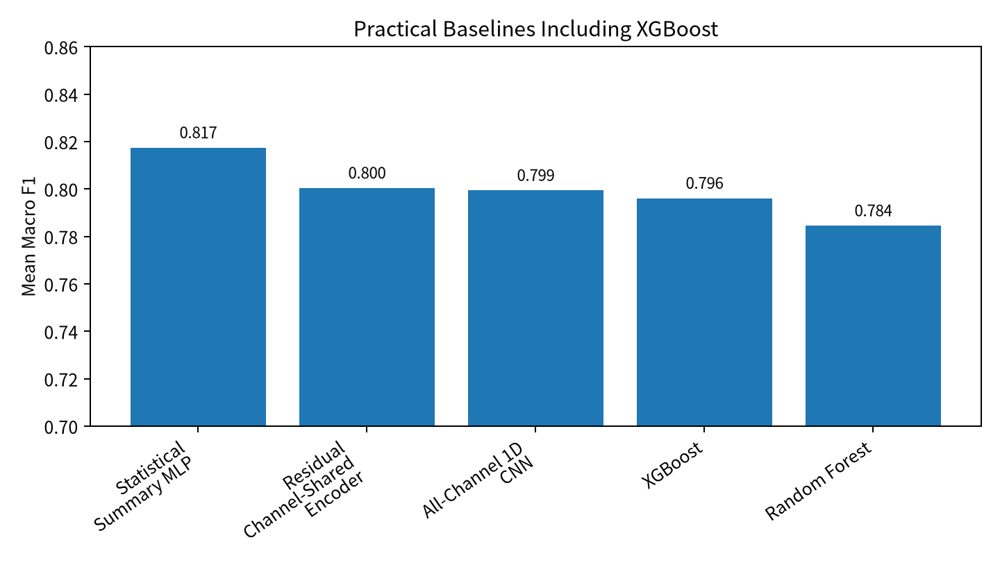

| model_display_name | accuracy | macro_f1 | macro_f1_ci | role |
| --- | --- | --- | --- | --- |
| Statistical Summary MLP | 0.8250 | 0.8174 | [0.7744, 0.8584] | summary-statistics practical baseline |
| Residual Channel-Shared Encoder | 0.8094 | 0.8004 | [0.7423, 0.8540] | proposed core extractor |
| All-Channel 1D CNN | 0.8250 | 0.7994 | [0.7404, 0.8564] | all-channel neural baseline |
| XGBoost | 0.8156 | 0.7961 | [0.7567, 0.8328] | boosted tree practical baseline |
| Random Forest | 0.8056 | 0.7845 | [0.7318, 0.8376] | tree-based practical baseline |

XGBoost completion 결과는 Macro F1 0.7961이고 Random Forest는 0.7845였다. XGBoost와 RF, Statistical Summary MLP, Residual Channel-Shared Encoder, All-Channel 1D CNN의 paired confidence interval은 모두 0을 포함했다. 따라서 XGBoost가 명확히 우월하다고 말하지 않고, tree-based practical baseline이 강하다고 정리하는 것이 안전하다.

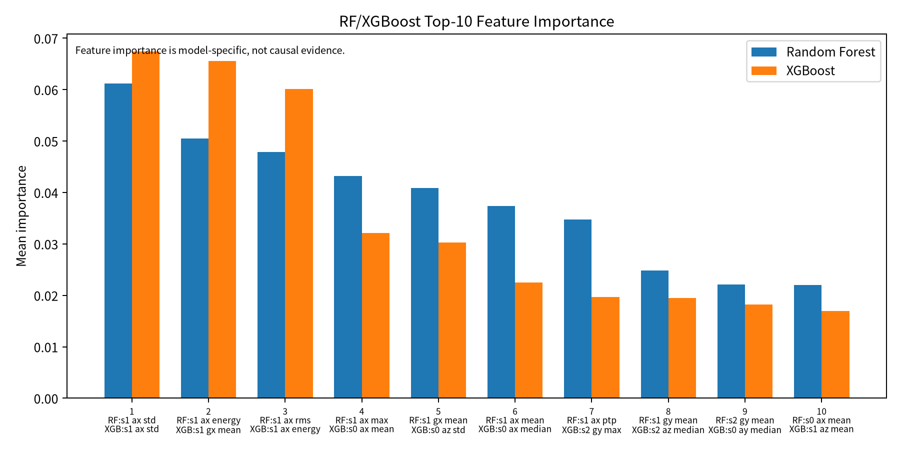

| rank | random_forest_feature | rf_importance | xgboost_feature | xgb_importance | note |
| --- | --- | --- | --- | --- | --- |
| 1 | s1_ax_std | 0.0612 | s1_ax_std | 0.0674 | s1/s0 중심 signal-derived feature; 인과 단정 금지 |
| 2 | s1_ax_energy | 0.0505 | s1_gx_mean | 0.0656 | model-specific importance |
| 3 | s1_ax_rms | 0.0479 | s1_ax_energy | 0.0601 | model-specific importance |
| 4 | s1_ax_max | 0.0432 | s0_ax_mean | 0.0321 | model-specific importance |
| 5 | s1_gx_mean | 0.0409 | s0_az_std | 0.0303 | model-specific importance |
| 6 | s1_ax_mean | 0.0374 | s0_ax_median | 0.0225 | model-specific importance |
| 7 | s1_ax_ptp | 0.0347 | s2_gy_max | 0.0197 | model-specific importance |
| 8 | s1_gy_mean | 0.0248 | s2_az_median | 0.0195 | model-specific importance |
| 9 | s2_gy_mean | 0.0221 | s0_ay_median | 0.0182 | model-specific importance |
| 10 | s0_ax_mean | 0.0220 | s1_az_mean | 0.0170 | model-specific importance |

RF와 XGBoost 모두 s1_ax, s1_gx 관련 feature가 중요하게 나타났다. 다만 feature importance는 모델 내부 중요도이므로 생체역학적 인과로 단정하지 않는다.

## 8. Class 3 Excessive Lean 분석

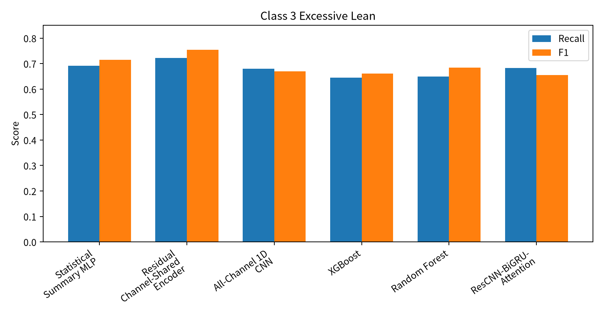

| model_display_name | class3_recall | class3_f1 | interpretation |
| --- | --- | --- | --- |
| Statistical Summary MLP | 0.6917 | 0.7150 | summary feature도 Class 3에서 강함. |
| Residual Channel-Shared Encoder | 0.7222 | 0.7542 | 어려운 Excessive Lean class에서 높은 F1. |
| All-Channel 1D CNN | 0.6806 | 0.6692 | class-wise reference. |
| XGBoost | 0.6444 | 0.6614 | precision은 높지만 recall은 제한적. |
| Random Forest | 0.6500 | 0.6848 | class-wise reference. |
| ResCNN-BiGRU-Attention | 0.6833 | 0.6552 | class-wise reference. |

Class 3 Excessive Lean은 pilot 단계부터 어려운 class였다. Residual Channel-Shared Encoder 계열은 이 class에서 비교적 높은 F1을 보였지만, 완전히 해결했다고 과장해서는 안 된다.

## 9. 현재 논문에서 주장 가능한 것 / 피해야 할 것

| claim | status | rationale | safe_wording |
| --- | --- | --- | --- |
| Residual branch가 shared encoder bottleneck을 크게 완화했다. | safe | Shared 1D Macro F1 0.2806에서 Residual Channel-Shared Encoder 0.8004로 상승했다. | 잔차 통계 branch는 naive shared encoder의 성능 저하를 크게 완화했다. |
| Residual Channel-Shared Encoder가 모든 baseline보다 우월하다. | avoid | Statistical Summary MLP가 가장 높고, XGBoost 및 all-channel CNN과의 paired CI가 0을 포함한다. | Residual Channel-Shared Encoder는 강한 practical/neural baseline과 경쟁 가능한 성능을 보였다. |
| Attention이 핵심 성능 요인이다. | avoid | v3 ablation에서 no-attention meanpool이 original v3와 가까웠다. | attention은 해석 보조 요소이며, 핵심 claim은 residual branch와 shared bottleneck 완화에 둔다. |
| RF/XGBoost feature importance는 원인 설명이다. | avoid | feature importance는 모델 내부 기준이며 생체역학적 인과를 직접 증명하지 않는다. | s1_ax 및 s1_gx 관련 요약 통계가 모델에서 반복적으로 중요하게 관찰되었다. |
| Transfer learning 효과를 검증했다. | avoid | 이번 보고 범위에는 SSL/external dataset adapter/transfer learning 실험이 없다. | Transfer learning은 후속 연구 범위로 남긴다. |

안전한 주장은 “Residual Channel-Shared Encoder가 naive shared encoder의 병목을 완화했고, 강한 practical/neural baseline과 경쟁 가능한 성능을 보였다”는 수준이다. 피해야 할 주장은 “모든 baseline보다 통계적으로 유의하게 우월하다”, “attention이 핵심이다”, “transfer learning을 검증했다”는 식의 과장이다.

## 10. 국내 저널용 최종 범위 제안

| item | include_in_kiee | reason | future_work |
| --- | --- | --- | --- |
| Clean-room dataset conversion | yes | 데이터/누수 통제의 신뢰 기반 | 외부 공개 가능성 검토 |
| Controlled feature extractor comparison | yes | 교수님 피드백의 핵심 비교 | 추가 dataset에서 재검증 |
| Residual Channel-Shared Encoder | yes | shared encoder 병목 완화 claim의 중심 | 위치 embedding/attention 세부 ablation 확장 |
| RF/XGBoost/Stats MLP practical baselines | yes | 강한 practical baseline을 투명하게 보고 | feature robustness 분석 |
| SSL | no | 이번 supervised protocol 범위 밖 | 후속 국제 논문 후보 |
| External transfer benchmark | no | adapter 및 protocol 미확정 | 후속 연구 |
| Real-time system | limited | 배경/응용 가능성으로만 언급 | 시스템 논문으로 분리 |

국내 저널에서는 supervised target dataset, clean-room conversion, LOSO protocol, controlled feature extractor comparison, RF/XGBoost/Stats MLP practical baseline, Class 3 분석까지가 적절하다. SSL, external transfer, real-time system은 후속 연구 또는 별도 논문으로 분리하는 것이 안전하다.

## 11. 교수님께 확인받을 질문

1. 제안 모델명을 `Residual Channel-Shared Feature Extractor`로 정리해도 되는가?
2. Statistical Summary MLP가 가장 높은 점을 main table에 넣을지, practical baseline table로 분리할지?
3. position identity와 attention은 국내 논문 본문에서 줄이고 appendix/후속 연구로 둘지?
4. RF/XGBoost를 main comparison에 포함할지, reviewer-facing practical baseline으로 별도 제시할지?
5. 대한전기학회 투고 범위를 supervised IMU classification으로 제한해도 되는지?

## 12. Appendix: 실행 이력 및 commit

- GitHub repo: https://github.com/choijaeh01/Squat-Classifier
- Feature extractor comparison: read-only local result directory recorded in `docs/results_tracking.md`.
- XGBoost completion: `results/xgboost_only_completion/20260629_053235_xgboost_only_completion_v1/`
- Locked full matrix: `results/full_supervised_matrix/20260617_144309_full_supervised_matrix_v1/`
- Literature extension: `results/literature_baseline_full_extension/20260617_183952_literature_baseline_full_extension_v1/`
- v3 component ablation: `results/v3_component_ablation/20260617_202714_v3_component_ablation_v1/`
- GitHub selected artifacts: `docs/results_artifacts/`
- Report mirror: `docs/professor_report_v1/`

검증 결과, full matrix integrity check와 unit test가 통과했다. 이 보고서 작성 과정에서 새 학습, CAU training, hyperparameter tuning, split/preprocessing/scaler/feature set 변경은 수행하지 않았다.
