# Professor Report v2 - Architecture and Protocol

## 0. 이번 v2 보강의 목적

기존 교수님 보고서는 결과 요약 중심이었다. 이번 v2는 **실제 code 기반 architecture audit, normalization/scaler 순서, parameter count, confusion matrix, residual feature audit**을 보강했다. 새 학습, CAU training, model 재학습, hyperparameter 변경은 수행하지 않았다.

## 1. 핵심 결론

같은 classifier head 조건에서 단순 Shared 1D Encoder는 낮았지만, residual branch를 추가한 Residual Channel-Shared Encoder는 All-Channel 1D CNN, XGBoost, Random Forest와 경쟁 가능한 수준까지 회복했다. 다만 Statistical Summary MLP와 tree models도 강하므로, 논문 claim은 **압도적 우월성**이 아니라 **shared encoder bottleneck 완화**로 잡는 것이 안전하다.

## 2. 교수님 피드백 반영 상태

| feedback_item | status | evidence | note |
| --- | --- | --- | --- |
| XGBoost comparison | done | XGBoost completion results | No tuning or rerun in v2. |
| RF/XGBoost feature importance | done | top-10 feature importance table | Signal-derived features only. |
| normalization/scaler clarification | done | normalization protocol audit | Feature extraction happens after train-only scaler transform. |
| same classifier head comparison | done | common head verification table | 64-dim representation and 4,485-param head. |
| 1D / residual / 2D / MLP comparison | done | feature extractor comparison table | Display names used for report. |
| confusion matrix analysis | done | row-normalized and count confusion figures | Interpretation limited to visible patterns. |

## 3. Dataset and Evaluation Protocol

| item | value | note |
| --- | --- | --- |
| Sensors | 3 MPU-6050 IMUs | lower back/waist, right thigh, right calf |
| Channels | 18 | 3-axis accelerometer + 3-axis gyroscope per IMU |
| Window length | 512 | phase-normalized linear interpolation during conversion |
| Subjects | 6 | subject-independent LOSO |
| Classes | 5 | Correct, Knee Valgus, Butt Wink, Excessive Lean, Partial Squat |
| Windows | 600 | 20 windows per subject-class combination |
| Validation policy | within-train stratified LOSO | train 400 / val 100 / test 100 per fold |
| Scaler | train-only StandardScaler | fit on train indices only, then transform train/val/test |

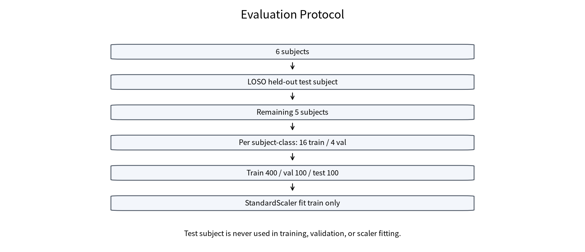

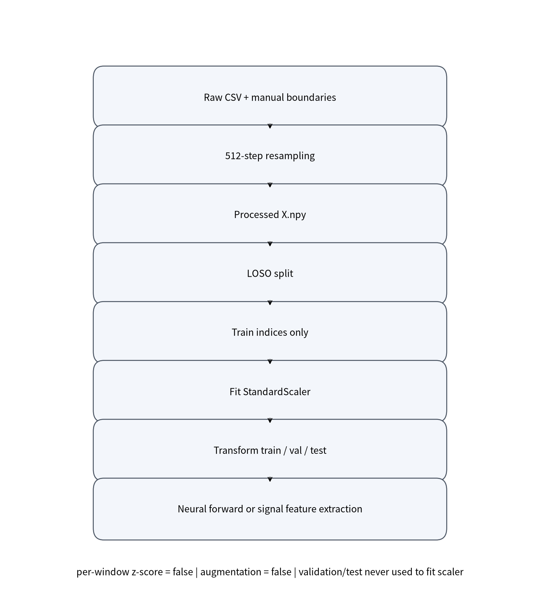

## 4. Normalization and Feature Extraction Order

| question | answer | evidence | status |
| --- | --- | --- | --- |
| Dataset conversion 단계에서 normalization을 했는가? | No | target conversion report and config specify normalization none; scaler is applied only inside fold runners. | confirmed |
| 512 resampling은 언제 이루어졌는가? | Before training, during target conversion from raw CSV/manual boundaries to processed X.npy. | processed dataset v1 contains 512-step windows; training runners load processed arrays. | confirmed |
| 학습 fold에서 StandardScaler는 언제 fit되는가? | After LOSO split construction and before model/classical feature evaluation, using train indices only. | Both supervised feature-extractor and XGBoost completion runners call TrainOnlyStandardScaler().fit(dataset.X, train_idx=split.train_idx). | confirmed |
| scaler fit에 사용된 sample은 train indices 400개뿐인가? | Yes | All scaler_fit_audit rows have scaler_fit_n_windows=400: True. | confirmed |
| validation/test window가 scaler fit에 들어갔는가? | No | val/test used flags are all False and scaler checks all passed: True. | confirmed |
| per-window z-score는 사용했는가? | No | feature-extractor comparison=False, xgboost=False. | confirmed |
| augmentation은 사용했는가? | No | feature-extractor comparison augmentation enabled=False; xgboost safety forbids augmentation=True. | confirmed |
| classical feature baseline의 feature는 scaler 적용 전 raw signal에서 계산되는가, train-scaled signal에서 계산되는가? | Train-scaled signal에서 계산된다. | runner creates X_scaled=scaler.transform(dataset.X), then run_classical_fold calls extract_window_features(X). | confirmed_from_code |
| Statistical Summary MLP와 residual branch statistics는 scaler 적용 전/후 어느 단계에서 계산되는가? | Train-scaled tensor가 model input으로 들어간 뒤, model 내부에서 mean/std/min/max를 계산한다. | The feature-extractor runner passes X_scaled to the fold evaluator; StatsMLPExtractor and Shared1DExtractor call raw_summary_features(x). | confirmed_from_code |
| XGBoost와 RF는 같은 feature set을 썼는가? | Yes | feature_audit allowed all features=True; both use extract_window_features. | confirmed |
| Tree model은 normalization에 덜 민감하지만, feature extraction/scaler policy는 neural baseline과 어떻게 맞췄는가? | 동일 LOSO split과 train-only StandardScaler transform 후 같은 signal-derived feature set으로 fit/predict했다. | RF/SVM and XGBoost completion paths both use TrainOnlyStandardScaler and extract_window_features on X_scaled. | confirmed |

| pipeline | order | feature_source | feature_count | metadata_used | note |
| --- | --- | --- | --- | --- | --- |
| Neural temporal extractors | processed X.npy -> LOSO split -> train-only StandardScaler fit -> transform train/val/test -> neural forward | scaled IMU tensor | not_applicable | False | All controlled neural models receive scaled tensors. |
| Statistical Summary MLP | processed X.npy -> scaler transform -> model internal mean/std/min/max -> common head | scaled IMU tensor | 72 | False | Uses mean, std, min, max for each of 18 channels. |
| Residual branch inside Residual Channel-Shared Encoder | processed X.npy -> scaler transform -> shared encoder branch plus internal mean/std/min/max residual branch -> fusion -> common head | scaled IMU tensor | 72 | False | Residual branch uses the same raw_summary_features function as Statistical Summary MLP. |
| Random Forest / Linear SVM / XGBoost | processed X.npy -> scaler transform -> extract_window_features -> estimator.fit(train features only) | scaled IMU tensor | 162 | False | Feature set: mean, std, min, max, median, energy, RMS, peak-to-peak, dominant FFT bin. |

핵심은 feature extraction도 fold 내부 scaler 정책 뒤에 위치한다는 점이다. Statistical Summary MLP와 residual branch의 mean/std/min/max는 train-only StandardScaler로 transform된 tensor에서 계산된다. RF, XGBoost, SVM도 같은 scaled signal에서 signal-derived feature를 계산한 뒤 train feature만으로 estimator를 fit한다.

## 5. Common Classifier Head

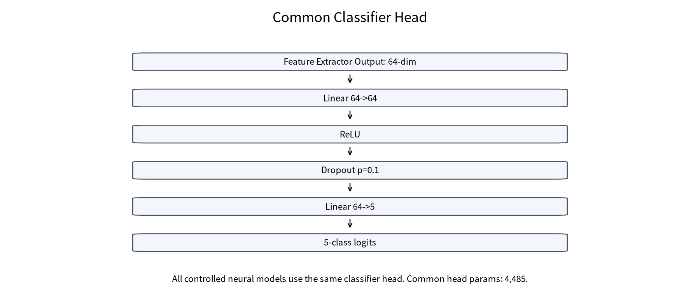

| model_display_name | representation_dim | common_head_params | common_head_signature | representation_dim_is_64 | common_head_param_count_is_4485 | common_head_signature_matches |
| --- | --- | --- | --- | --- | --- | --- |
| Statistical Summary MLP | 64 | 4485 | linear:64->64&#124;relu&#124;dropout:0.1&#124;linear:64->5 | True | True | True |
| All-Channel 1D CNN | 64 | 4485 | linear:64->64&#124;relu&#124;dropout:0.1&#124;linear:64->5 | True | True | True |
| Compact All-Channel 1D CNN | 64 | 4485 | linear:64->64&#124;relu&#124;dropout:0.1&#124;linear:64->5 | True | True | True |
| Shared 1D Encoder | 64 | 4485 | linear:64->64&#124;relu&#124;dropout:0.1&#124;linear:64->5 | True | True | True |
| Shared 1D + Identity | 64 | 4485 | linear:64->64&#124;relu&#124;dropout:0.1&#124;linear:64->5 | True | True | True |
| Residual Channel-Shared Encoder | 64 | 4485 | linear:64->64&#124;relu&#124;dropout:0.1&#124;linear:64->5 | True | True | True |
| Residual Channel-Shared + Identity | 64 | 4485 | linear:64->64&#124;relu&#124;dropout:0.1&#124;linear:64->5 | True | True | True |
| 2D CNN | 64 | 4485 | linear:64->64&#124;relu&#124;dropout:0.1&#124;linear:64->5 | True | True | True |

모든 controlled neural model은 64차원 representation을 만들고 동일한 MLP head를 사용한다. 공통 head parameter count는 4,485다. 따라서 이번 비교는 classifier 차이가 아니라 feature extractor 차이에 더 초점을 맞춘다.

## 6. Architecture Details

### 6.1 Statistical Summary MLP

Statistical Summary MLP는 scaled IMU tensor에서 mean/std/min/max 72개 feature를 계산하고 64차원 representation으로 projection한다. code audit 기준으로 energy/RMS는 이 residual/statistical MLP branch에는 포함되지 않는다.

### 6.2 All-Channel 1D CNN

All-Channel 1D CNN은 18채널을 첫 convolution부터 함께 처리한다. 채널 간 상호작용을 직접 학습할 수 있는 baseline이다.

### 6.3 Shared 1D Encoder

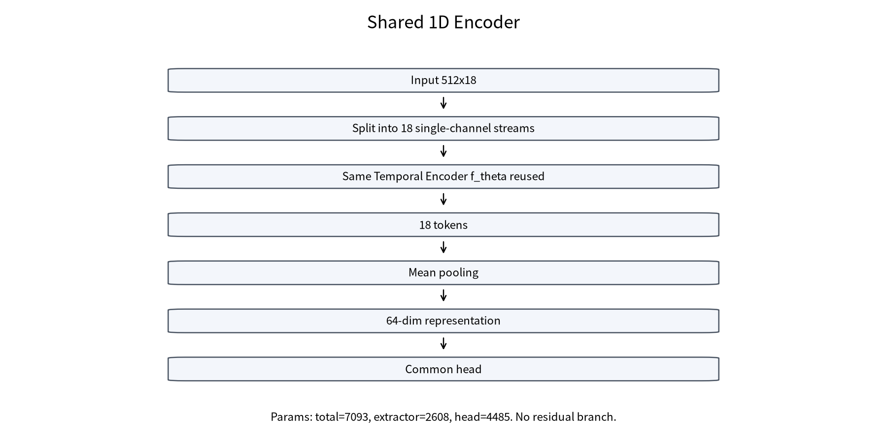

Shared 1D Encoder는 18개 단일 채널 stream에 같은 Temporal Encoder를 재사용한다. parameter sharing은 되지만 residual branch가 없어서 channel-specific statistical cue가 약해질 수 있다.

### 6.4 Residual Channel-Shared Encoder

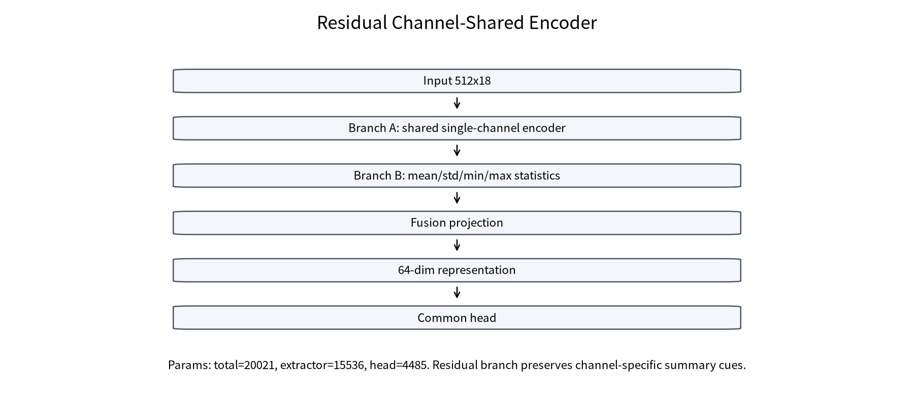

Residual Channel-Shared Encoder는 shared temporal branch와 signal-derived residual branch를 결합한다. residual branch는 mean/std/min/max를 사용해 shared encoder가 잃을 수 있는 channel-specific summary signal을 보완한다.

### 6.5 2D CNN

2D CNN은 time x channel matrix를 대상으로 convolution을 적용하는 baseline이다.

### 6.6 RF/XGBoost/SVM

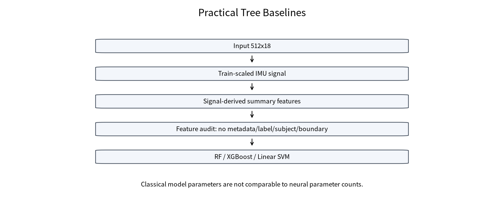

Tree baselines는 scaled IMU signal에서 signal-derived summary feature를 계산한다. feature audit 기준 metadata, label, subject ID, window boundary는 포함되지 않았다.

## 7. Parameter Count and Capacity

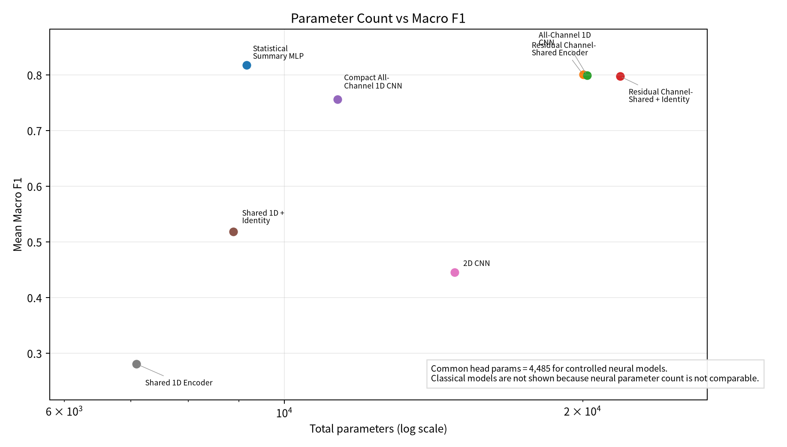

| model_display_name | group | total_params | extractor_params | common_head_params | residual_branch_params | identity_embedding_params | representation_dim | macro_f1 | interpretation |
| --- | --- | --- | --- | --- | --- | --- | --- | --- | --- |
| Statistical Summary MLP | Practical Baseline | 9157 | 4672 | 4485 | 4672 | 0 | 64 | 0.8174 | 작은 neural summary baseline. |
| Residual Channel-Shared Encoder | Proposed Core | 20021 | 15536 | 4485 | 12928 | 0 | 64 | 0.8004 | shared encoder에 작은 residual branch를 결합. |
| All-Channel 1D CNN | Neural Baseline | 20197 | 15712 | 4485 | 0 | 0 | 64 | 0.7994 | controlled neural parameter count. |
| Residual Channel-Shared + Identity | Neural Baseline | 21813 | 17328 | 4485 | 12928 | 1664 | 64 | 0.7973 | controlled neural parameter count. |
| Compact All-Channel 1D CNN | Neural Baseline | 11317 | 6832 | 4485 | 0 | 0 | 64 | 0.7562 | controlled neural parameter count. |
| Raw Flatten MLP | Neural Baseline |  |  |  |  |  |  | 0.7046 | 매우 큰 parameter count에도 최고 성능은 아님. |
| Shared 1D + Identity | Neural Baseline | 8885 | 4400 | 4485 | 0 | 1664 | 64 | 0.5182 | controlled neural parameter count. |
| 2D CNN | Neural Baseline | 14853 | 10368 | 4485 | 0 | 0 | 64 | 0.4452 | controlled neural parameter count. |
| Shared 1D Encoder | Neural Baseline | 7093 | 2608 | 4485 | 0 | 0 | 64 | 0.2806 | controlled neural parameter count. |
| Random Forest | Practical Baseline | not_applicable | not_applicable | not_applicable | not_applicable | not_applicable | not_applicable | 0.7845 | classical/tree model; neural parameter count와 직접 비교하지 않음. |
| XGBoost | Practical Baseline | not_applicable | not_applicable | not_applicable | not_applicable | not_applicable | not_applicable | 0.7961 | classical/tree model; neural parameter count와 직접 비교하지 않음. |
| Linear SVM | Practical Baseline | not_applicable | not_applicable | not_applicable | not_applicable | not_applicable | not_applicable | 0.7213 | classical/tree model; neural parameter count와 직접 비교하지 않음. |

Parameter count와 성능은 단순 비례하지 않았다. Raw Flatten MLP는 매우 크지만 최고 성능은 아니며, common head parameter는 controlled neural models에서 동일하다. Classical models는 neural parameter count와 직접 비교하지 않는다.

## 8. Main Controlled Results

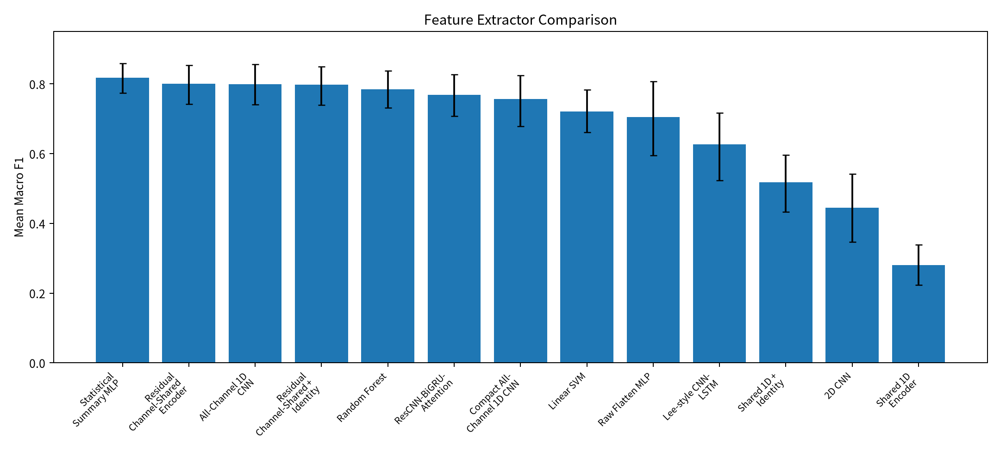

| model_display_name | group | accuracy | macro_f1 | weighted_f1 | macro_f1_ci | role | interpretation |
| --- | --- | --- | --- | --- | --- | --- | --- |
| Statistical Summary MLP | Practical Baseline | 0.8250 | 0.8174 | 0.8174 | [0.7744, 0.8584] | summary-statistics practical baseline | 현재 데이터에서 signal summary가 매우 강함. |
| Residual Channel-Shared Encoder | Proposed Core | 0.8094 | 0.8004 | 0.8004 | [0.7423, 0.8540] | proposed core extractor | residual branch가 shared encoder 병목을 완화. |
| All-Channel 1D CNN | Neural Baseline | 0.8250 | 0.7994 | 0.7994 | [0.7404, 0.8564] | all-channel neural baseline | 채널 정보를 직접 학습하는 강한 neural baseline. |
| Residual Channel-Shared + Identity | Neural Baseline | 0.8072 | 0.7973 | 0.7973 | [0.7397, 0.8493] | comparison model | residual-only와 비슷해 identity 추가 이득은 제한적. |
| Random Forest | Practical Baseline | 0.8056 | 0.7845 | 0.7845 | [0.7318, 0.8376] | tree-based practical baseline | 비교용 모델. |
| ResCNN-BiGRU-Attention | Literature Reference | 0.7944 | 0.7691 | 0.7691 | [0.7076, 0.8270] | comparison model | 비교용 모델. |
| Compact All-Channel 1D CNN | Neural Baseline | 0.7806 | 0.7562 | 0.7562 | [0.6786, 0.8242] | comparison model | 비교용 모델. |
| Linear SVM | Practical Baseline | 0.7461 | 0.7213 | 0.7213 | [0.6612, 0.7828] | linear feature baseline | 비교용 모델. |
| Raw Flatten MLP | Neural Baseline | 0.7344 | 0.7046 | 0.7046 | [0.5953, 0.8074] | comparison model | parameter가 크지만 최고 성능은 아님. |
| Lee-style CNN-LSTM | Literature Reference | 0.6622 | 0.6269 | 0.6269 | [0.5237, 0.7165] | comparison model | 비교용 모델. |
| Shared 1D + Identity | Neural Baseline | 0.5617 | 0.5182 | 0.5182 | [0.4335, 0.5968] | comparison model | identity만으로는 병목 해결이 부족. |
| 2D CNN | Neural Baseline | 0.5056 | 0.4452 | 0.4452 | [0.3472, 0.5413] | comparison model | time-channel 2D baseline은 낮게 관찰. |
| Shared 1D Encoder | Neural Baseline | 0.3500 | 0.2806 | 0.2806 | [0.2233, 0.3385] | comparison model | 단독 shared pooling은 underfit. |

핵심 수치는 Shared 1D Encoder 0.2806, Shared 1D + Identity 0.5182, Residual Channel-Shared Encoder 0.8004, Residual Channel-Shared + Identity 0.7973, All-Channel 1D CNN 0.7994, Statistical Summary MLP 0.8174, XGBoost 0.7961이다.

## 9. Residual Branch Effect

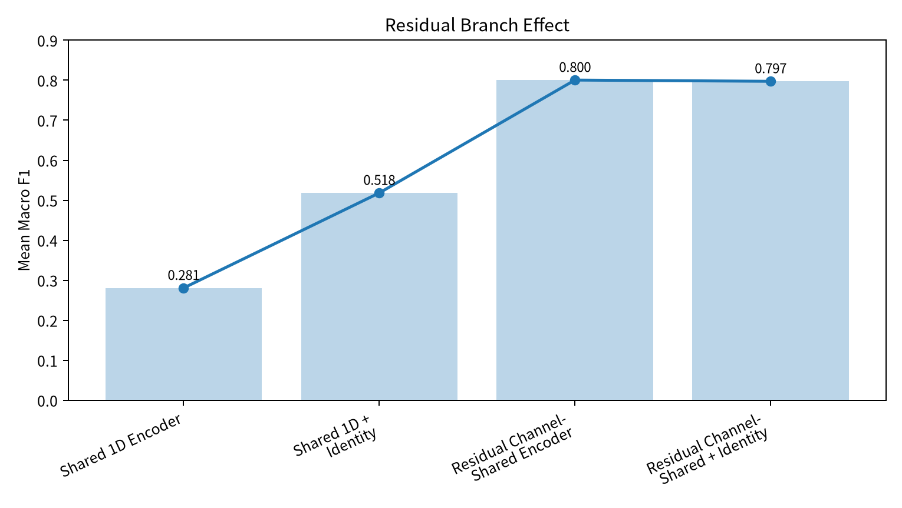

| model_display_name | macro_f1 | delta_from_shared_1d | meaning |
| --- | --- | --- | --- |
| Shared 1D Encoder | 0.2806 | +0.0000 | 공유 encoder만 사용하면 채널 위치와 통계 단서가 약해진다. |
| Shared 1D + Identity | 0.5182 | +0.2376 | identity embedding만으로는 병목 완화가 제한적이다. |
| Residual Channel-Shared Encoder | 0.8004 | +0.5198 | signal-derived residual branch가 병목을 크게 완화한다. |
| Residual Channel-Shared + Identity | 0.7973 | +0.5167 | residual 위에 identity를 추가해도 추가 이득은 작았다. |

Identity만으로는 충분하지 않았고 residual branch가 가장 큰 변화를 만들었다. 국내 논문 claim은 residual branch 중심으로 잡는 것이 안전하다.

## 10. Practical Baselines: Statistical MLP, RF, XGBoost

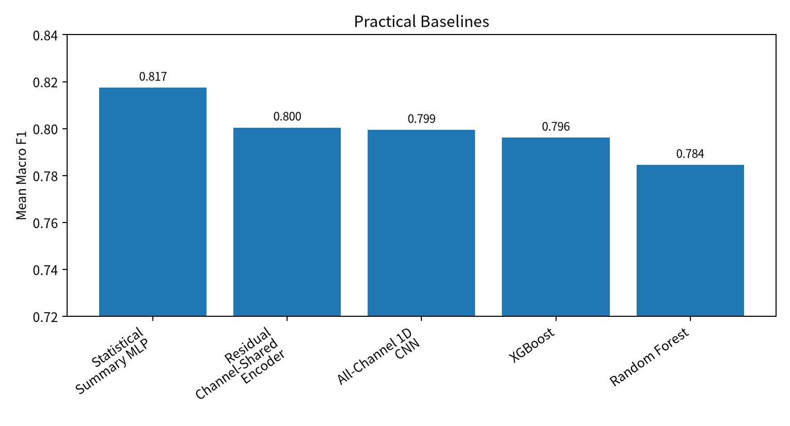

| model_display_name | accuracy | macro_f1 | macro_f1_ci | role |
| --- | --- | --- | --- | --- |
| Statistical Summary MLP | 0.8250 | 0.8174 | [0.7744, 0.8584] | summary-statistics practical baseline |
| Residual Channel-Shared Encoder | 0.8094 | 0.8004 | [0.7423, 0.8540] | proposed core extractor |
| All-Channel 1D CNN | 0.8250 | 0.7994 | [0.7404, 0.8564] | all-channel neural baseline |
| XGBoost | 0.8156 | 0.7961 | [0.7567, 0.8328] | boosted tree practical baseline |
| Random Forest | 0.8056 | 0.7845 | [0.7318, 0.8376] | tree-based practical baseline |

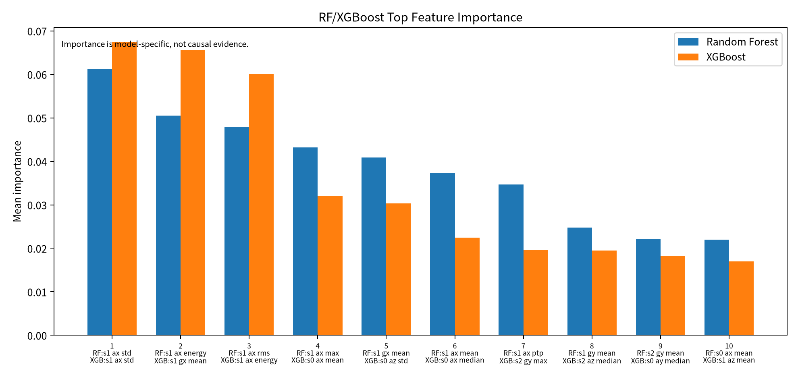

| rank | random_forest_feature | rf_importance | xgboost_feature | xgb_importance | note |
| --- | --- | --- | --- | --- | --- |
| 1 | s1_ax_std | 0.0612 | s1_ax_std | 0.0674 | s1_ax/s1_gx 관련 feature가 반복 관찰되지만 인과 단정은 금지 |
| 2 | s1_ax_energy | 0.0505 | s1_gx_mean | 0.0656 | model-specific importance |
| 3 | s1_ax_rms | 0.0479 | s1_ax_energy | 0.0601 | model-specific importance |
| 4 | s1_ax_max | 0.0432 | s0_ax_mean | 0.0321 | model-specific importance |
| 5 | s1_gx_mean | 0.0409 | s0_az_std | 0.0303 | model-specific importance |
| 6 | s1_ax_mean | 0.0374 | s0_ax_median | 0.0225 | model-specific importance |
| 7 | s1_ax_ptp | 0.0347 | s2_gy_max | 0.0197 | model-specific importance |
| 8 | s1_gy_mean | 0.0248 | s2_az_median | 0.0195 | model-specific importance |
| 9 | s2_gy_mean | 0.0221 | s0_ay_median | 0.0182 | model-specific importance |
| 10 | s0_ax_mean | 0.0220 | s1_az_mean | 0.0170 | model-specific importance |

s1_ax, s1_gx 관련 feature가 반복적으로 관찰되지만, feature importance는 모델 내부 중요도일 뿐 생체역학적 인과 증거가 아니다.

## 11. Confusion Matrix Analysis

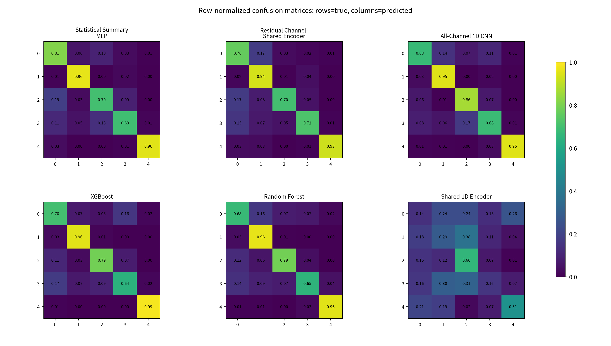

| model_display_name | class_id | class_name | true_count | correct_count | recall | major_confusion_1 | major_confusion_2 | note |
| --- | --- | --- | --- | --- | --- | --- | --- | --- |
| Statistical Summary MLP | 0 | Correct | 360 | 293 | 0.8139 | Butt Wink (35) | Knee Valgus (20) |  |
| Statistical Summary MLP | 1 | Knee Valgus | 360 | 347 | 0.9639 | Excessive Lean (8) | Correct (4) |  |
| Statistical Summary MLP | 2 | Butt Wink | 360 | 252 | 0.7000 | Correct (67) | Excessive Lean (31) |  |
| Statistical Summary MLP | 3 | Excessive Lean | 360 | 249 | 0.6917 | Butt Wink (48) | Correct (41) | Excessive Lean 주요 관심 class. |
| Statistical Summary MLP | 4 | Partial Squat | 360 | 344 | 0.9556 | Correct (12) | Excessive Lean (3) |  |
| Residual Channel-Shared Encoder | 0 | Correct | 360 | 275 | 0.7639 | Knee Valgus (63) | Butt Wink (11) |  |
| Residual Channel-Shared Encoder | 1 | Knee Valgus | 360 | 337 | 0.9361 | Excessive Lean (14) | Correct (7) |  |
| Residual Channel-Shared Encoder | 2 | Butt Wink | 360 | 252 | 0.7000 | Correct (62) | Knee Valgus (28) |  |
| Residual Channel-Shared Encoder | 3 | Excessive Lean | 360 | 260 | 0.7222 | Correct (55) | Knee Valgus (25) | Excessive Lean 주요 관심 class. |
| Residual Channel-Shared Encoder | 4 | Partial Squat | 360 | 333 | 0.9250 | Correct (12) | Knee Valgus (11) |  |
| All-Channel 1D CNN | 0 | Correct | 360 | 243 | 0.6750 | Knee Valgus (51) | Excessive Lean (38) |  |
| All-Channel 1D CNN | 1 | Knee Valgus | 360 | 343 | 0.9528 | Correct (11) | Excessive Lean (6) |  |
| All-Channel 1D CNN | 2 | Butt Wink | 360 | 311 | 0.8639 | Excessive Lean (24) | Correct (23) |  |
| All-Channel 1D CNN | 3 | Excessive Lean | 360 | 245 | 0.6806 | Butt Wink (60) | Correct (30) | Excessive Lean 주요 관심 class. |
| All-Channel 1D CNN | 4 | Partial Squat | 360 | 343 | 0.9528 | Excessive Lean (11) | Correct (4) |  |
| XGBoost | 0 | Correct | 360 | 253 | 0.7028 | Excessive Lean (57) | Knee Valgus (26) |  |
| XGBoost | 1 | Knee Valgus | 360 | 344 | 0.9556 | Correct (10) | Butt Wink (5) |  |
| XGBoost | 2 | Butt Wink | 360 | 284 | 0.7889 | Correct (39) | Excessive Lean (27) |  |
| XGBoost | 3 | Excessive Lean | 360 | 232 | 0.6444 | Correct (63) | Butt Wink (34) | Excessive Lean 주요 관심 class. |
| XGBoost | 4 | Partial Squat | 360 | 355 | 0.9861 | Correct (4) | Knee Valgus (1) |  |
| Random Forest | 0 | Correct | 360 | 243 | 0.6750 | Knee Valgus (58) | Butt Wink (27) |  |
| Random Forest | 1 | Knee Valgus | 360 | 346 | 0.9611 | Correct (12) | Butt Wink (2) |  |
| Random Forest | 2 | Butt Wink | 360 | 283 | 0.7861 | Correct (44) | Knee Valgus (20) |  |
| Random Forest | 3 | Excessive Lean | 360 | 234 | 0.6500 | Correct (50) | Knee Valgus (33) | Excessive Lean 주요 관심 class. |
| Random Forest | 4 | Partial Squat | 360 | 344 | 0.9556 | Excessive Lean (9) | Correct (4) |  |
| Shared 1D Encoder | 0 | Correct | 360 | 50 | 0.1389 | Partial Squat (93) | Knee Valgus (85) | Shared-only failure pattern 확인 필요. |
| Shared 1D Encoder | 1 | Knee Valgus | 360 | 104 | 0.2889 | Butt Wink (136) | Correct (66) |  |
| Shared 1D Encoder | 2 | Butt Wink | 360 | 237 | 0.6583 | Correct (53) | Knee Valgus (43) |  |
| Shared 1D Encoder | 3 | Excessive Lean | 360 | 56 | 0.1556 | Butt Wink (113) | Knee Valgus (107) | Shared-only failure pattern 확인 필요. |
| Shared 1D Encoder | 4 | Partial Squat | 360 | 183 | 0.5083 | Correct (75) | Knee Valgus (67) |  |

Confusion matrix는 행이 true class, 열이 predicted class다. 본문에서는 row-normalized grid를 우선 사용해 class별 recall과 주요 혼동 방향을 본다. 해석은 Class 3 Excessive Lean과 Shared 1D Encoder failure pattern 중심으로 제한한다.

## 12. Class 3 Excessive Lean

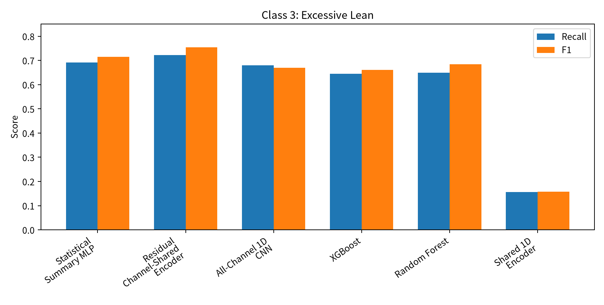

| model_display_name | class3_recall | class3_f1 | interpretation |
| --- | --- | --- | --- |
| Statistical Summary MLP | 0.6917 | 0.7150 | class-wise reference. |
| Residual Channel-Shared Encoder | 0.7222 | 0.7542 | Class 3에서 높은 F1을 보인 proposed core. |
| All-Channel 1D CNN | 0.6806 | 0.6692 | class-wise reference. |
| XGBoost | 0.6444 | 0.6614 | tree baseline reference. |
| Random Forest | 0.6500 | 0.6848 | class-wise reference. |
| Shared 1D Encoder | 0.1556 | 0.1573 | Shared-only failure pattern 확인용. |

Residual Channel-Shared Encoder는 Class 3에서 비교적 높은 F1을 보였지만, 이 class를 완전히 해결했다고 과장하지 않는다.

## 13. What This Means for the Paper

| claim | status | rationale | safe_wording |
| --- | --- | --- | --- |
| Residual branch가 shared encoder bottleneck을 완화했다. | safe | Shared 1D 0.2806 -> Residual Channel-Shared 0.8004. | 잔차 branch는 naive shared encoder의 성능 저하를 크게 완화했다. |
| 제안 모델이 모든 baseline보다 통계적으로 유의하게 우수하다. | avoid | Statistical Summary MLP가 가장 높고 CI overlap이 존재한다. | 강한 neural/practical baseline과 경쟁 가능한 성능을 보였다. |
| feature importance가 생체역학적 원인을 증명한다. | avoid | importance는 모델 내부 기준이다. | s1_ax/s1_gx 관련 feature가 반복적으로 중요하게 관찰되었다. |
| transfer learning이 검증되었다. | avoid | 이번 범위에는 external/SSL 실험이 없다. | 후속 연구로 남긴다. |

## 14. Recommended KIEE Scope

| item | include_in_kiee | reason | future_work |
| --- | --- | --- | --- |
| Supervised IMU-only target dataset | yes | 논문 핵심 범위 |  |
| Clean-room conversion and LOSO protocol | yes | 재현성과 누수 통제 근거 |  |
| Controlled feature extractor comparison | yes | 교수님 피드백 핵심 |  |
| RF/XGBoost/Stats MLP baselines | yes | 강한 practical baselines 투명 보고 |  |
| SSL/external transfer | no | 이번 supervised paper 범위 밖 | 후속 논문 |

## 15. Questions for Professor

1. 논문 제목 또는 제안 구조명을 `Residual Channel-Shared Feature Extractor`로 잡아도 되는가?
2. Statistical Summary MLP가 가장 높은 점을 practical baseline으로 분리해서 배치할지?
3. position identity와 attention은 본문에서 낮추고 future work로 둘지?
4. confusion matrix와 parameter count를 본문에 어느 정도 넣을지?
5. KIEE 범위를 supervised IMU-only classification으로 확정해도 되는지?

## Appendix A. Internal Name Mapping

Internal model names are kept in `tables/table_internal_name_mapping.csv`. 이 appendix file에서만 internal names를 허용한다.

## Appendix B. Execution and Reproducibility

- 새 학습 실행: no
- CAU training 실행: no
- optimizer step/backward 실행: no
- architecture audit: synthetic input forward-only
- normalization audit: config, result CSV, runner code 기반
- local unit test: `python -m unittest discover -s tests -v`
- raw result directories: read-only input으로만 사용
