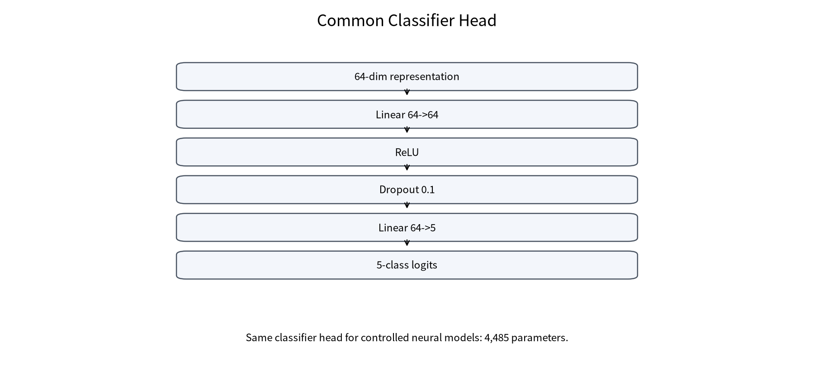
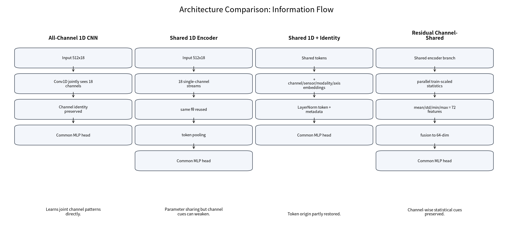
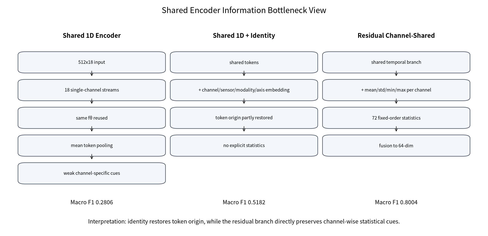
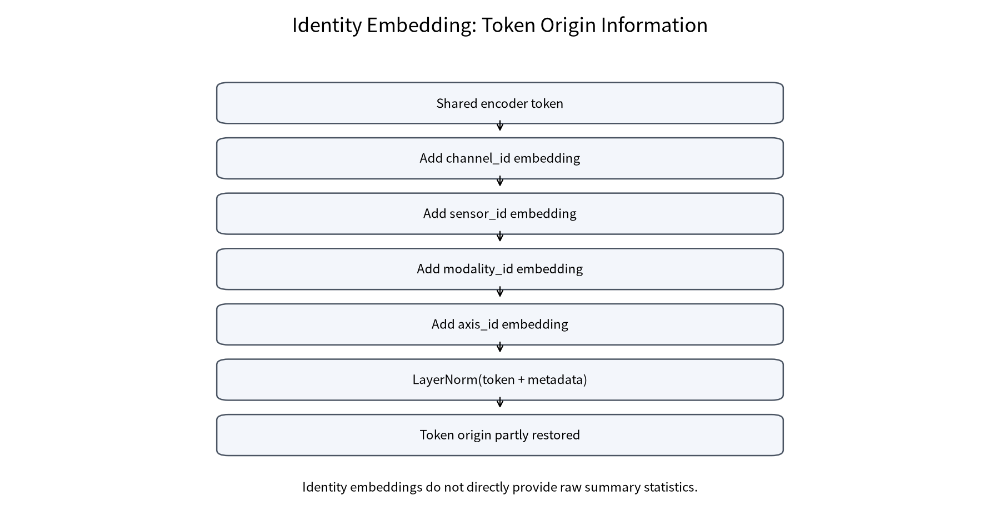
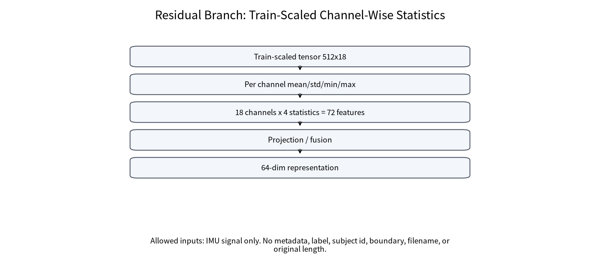
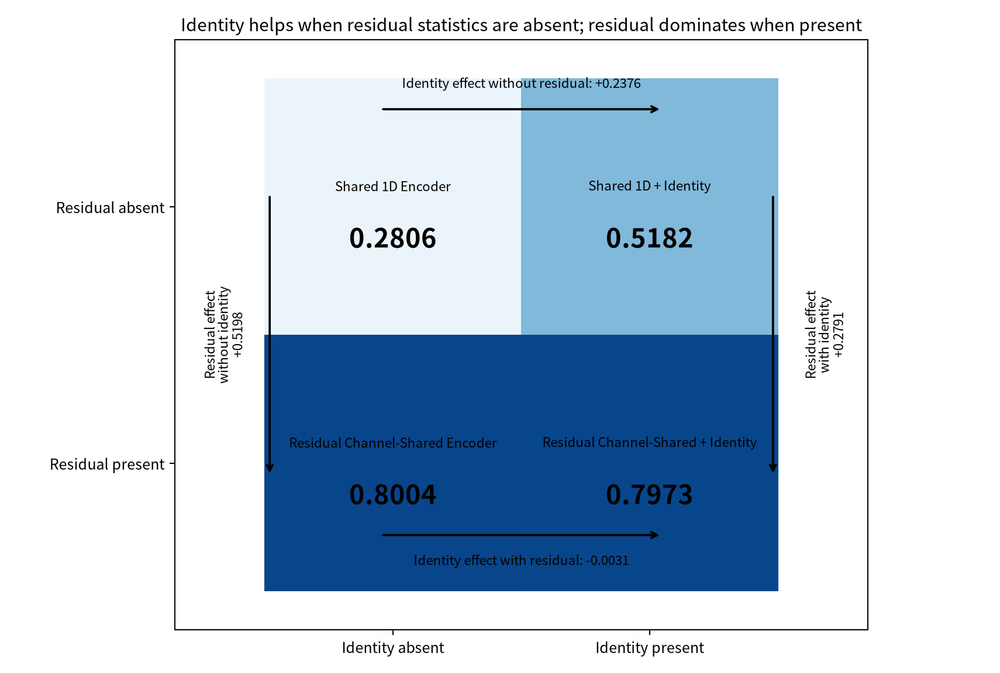
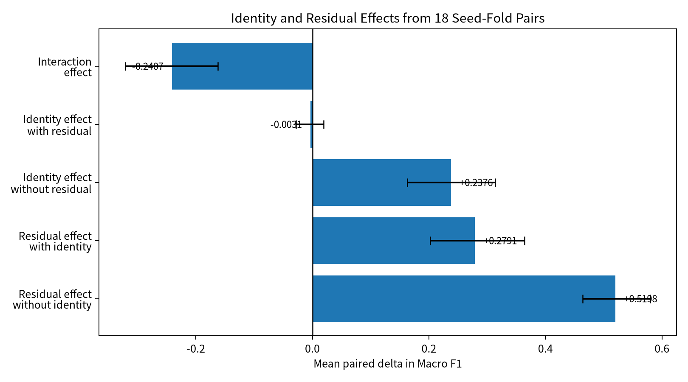

# Professor Report v3 - Story and Identity Analysis

## 0. 이번 v3 보강의 목적

v2는 architecture/protocol table을 보강했지만, **왜 identity가 shared-only에서는 도움이 되고 residual 이후에는 거의 도움이 되지 않았는지**에 대한 story가 부족했다. v3는 기존 결과만 사용해 identity/residual interaction을 정량화하고, 정보 흐름 중심 architecture diagram으로 논문 claim을 정리한다. 새 학습, CAU training, optimizer step, backpropagation, split/preprocessing/model 변경은 수행하지 않았다.

## 1. 한 줄 결론

Identity는 residual이 없을 때 shared token의 위치 손실을 일부 보완했다. 그러나 residual branch는 train-scaled tensor에서 channel-wise mean/std/min/max를 직접 보존하므로 훨씬 큰 성능 개선을 만들었다. Residual이 들어간 뒤에는 identity의 추가 이득이 작았다. 따라서 국내 논문 claim은 position identity보다 **residual branch가 shared encoder bottleneck을 완화한다**는 방향이 안전하다.

## 2. 왜 common classifier head가 필요했는가

기존 full matrix는 모델마다 head와 pathway가 달라, 성능 차이가 feature extractor 때문인지 classifier 때문인지 분리하기 어려웠다. 교수님 피드백 이후 controlled comparison에서는 모든 controlled neural model이 64차원 representation과 동일한 MLP classifier head를 사용하도록 맞췄다.

## 3. Architecture question: 무엇을 비교한 것인가

질문은 단순히 어떤 model이 높았는지가 아니라, **shared encoder가 parameter sharing을 얻는 대신 잃어버릴 수 있는 channel-specific cue를 어떤 방식으로 복원하는가**다.

## 4. Information bottleneck view

All-Channel CNN은 18채널을 처음부터 함께 보므로 channel identity를 자연스럽게 유지한다. 반면 Shared 1D Encoder는 18개 single-channel stream에 같은 encoder를 반복 적용하고 token pooling을 수행하므로, token origin과 channel-wise summary cue가 약해질 수 있다. Identity embedding은 token origin을 알려주지만, raw signal statistics 자체를 직접 제공하지는 않는다. Residual branch는 fixed channel order의 mean/std/min/max 72개 feature를 제공해 이 병목을 직접 보완한다.

## 5. Identity effect: residual이 없을 때는 도움이 됐다

Shared 1D Encoder의 Macro F1은 0.2806이고, Shared 1D + Identity는 0.5182다. seed-fold paired 기준 identity effect without residual은 +0.2376이었다. 이는 channel/sensor/modality/axis embedding이 shared token의 origin 손실을 일부 보완했음을 시사한다.

## 6. Residual effect: 더 큰 변화는 residual branch에서 나왔다

Residual Channel-Shared Encoder의 Macro F1은 0.8004다. Shared 1D 대비 residual effect without identity는 +0.5198로, identity effect보다 훨씬 컸다. residual branch는 train-scaled tensor에서 channel-wise mean/std/min/max 72 features를 계산하고, metadata, label, subject id, filename, boundary, original length는 사용하지 않는다.

## 7. 왜 residual 이후 identity가 거의 도움이 되지 않았는가

2x2 결과는 interaction을 명확히 보여준다. residual이 없을 때 identity effect는 +0.2376이지만, residual이 있을 때 identity effect는 -0.0031이다. 한 가지 가능한 해석은 residual branch가 fixed channel order의 statistics를 이미 제공하므로, identity embedding이 제공하는 token origin 정보와 일부 중복된다는 것이다. 다만 추가 parameter, 작은 데이터셋 variance, seed/fold별 변동 가능성도 있으므로 원인을 단정하지 않는다.

| residual_branch | identity_absent_model | identity_absent_macro_f1 | identity_present_model | identity_present_macro_f1 | identity_effect | interpretation |
| --- | --- | --- | --- | --- | --- | --- |
| Absent | Shared 1D Encoder | 0.2806 | Shared 1D + Identity | 0.5182 | +0.2376 | identity가 shared-only token origin 손실을 일부 보완한다. |
| Present | Residual Channel-Shared Encoder | 0.8004 | Residual Channel-Shared + Identity | 0.7973 | -0.0031 | residual branch가 있으면 identity 추가 이득은 작다. |

| effect_name | contrast | mean_delta | bootstrap_ci | n_pairs | interpretation_note |
| --- | --- | --- | --- | --- | --- |
| identity_effect_without_residual | Shared 1D + Identity - Shared 1D | 0.2376 | [0.1632, 0.3140] | 18 | Identity는 residual이 없을 때 token origin 손실을 일부 보완한다. |
| identity_effect_with_residual | Residual + Identity - Residual | -0.0031 | [-0.0284, 0.0193] | 18 | Residual branch가 들어간 뒤 identity 추가 이득은 거의 없거나 약간 음수다. |
| residual_effect_without_identity | Residual - Shared 1D | 0.5198 | [0.4637, 0.5799] | 18 | Residual branch는 shared-only 병목을 가장 크게 완화한다. |
| residual_effect_with_identity | Residual + Identity - Shared 1D + Identity | 0.2791 | [0.2022, 0.3641] | 18 | Identity가 있어도 residual branch의 추가 효과는 크다. |
| interaction_effect | (Residual+Identity - Residual) - (Identity - Shared) | -0.2407 | [-0.3211, -0.1620] | 18 | 음수 interaction은 residual branch가 identity embedding의 일부 역할을 대체했을 가능성을 시사한다. |

## 8. Practical baselines와의 관계

Statistical Summary MLP는 Macro F1 0.8174, XGBoost는 0.7961, Random Forest는 0.7845였다. 이 결과는 이 데이터셋에서 channel-wise summary statistics가 강한 signal임을 보여준다. Residual Channel-Shared Encoder는 raw temporal branch와 summary statistics branch를 결합한 hybrid extractor로 해석할 수 있다.

## 9. 논문 claim 조정

| claim | status | reason | safe_wording |
| --- | --- | --- | --- |
| Residual branch mitigates shared encoder bottleneck. | safe | Shared 1D 0.2806에서 Residual Channel-Shared 0.8004로 증가. | 잔차 통계 branch는 shared encoder 병목을 크게 완화했다. |
| Identity embedding is the main contribution. | avoid | identity는 residual이 없을 때만 크게 개선되고 residual 이후 추가 이득은 작음. | identity는 shared-only 구조에서 일부 보완 효과가 있었지만 핵심 claim은 residual branch다. |
| Residual Channel-Shared is statistically superior to all baselines. | avoid | Statistical Summary MLP, XGBoost, RF와 점수가 가깝고 CI overlap 가능. | 강한 practical/neural baseline과 경쟁 가능한 성능을 보였다. |
| Summary statistics are important in this dataset. | safe | Statistical Summary MLP, RF/XGBoost, residual branch가 모두 높은 성능. | 이 데이터셋에서는 channel-wise summary statistics가 강한 signal로 관찰되었다. |

정리하면 safe claim은 다음과 같다. residual branch가 shared encoder bottleneck을 완화했다. residual shared extractor는 All-Channel CNN, XGBoost, RF와 경쟁 가능하다. summary statistics가 강한 signal이다. 반대로 identity가 핵심이다, attention이 핵심이다, 모든 baseline보다 통계적으로 우수하다, transfer learning을 검증했다는 표현은 피해야 한다.

## 10. 교수님께 설명할 3분 버전

교수님, 이번에는 모델 구조별 head를 동일하게 고정한 상태에서 feature extractor만 비교했습니다. 결과를 보면 Shared 1D Encoder 단독은 Macro F1 0.2806으로 낮았고, identity를 넣으면 0.5182로 올라갔습니다. 즉, shared encoder가 channel origin 정보를 잃는 문제가 있고 identity embedding이 이를 일부 보완한 것으로 볼 수 있습니다.

그런데 residual branch를 넣으면 0.8004까지 올라갑니다. 이 residual branch는 metadata나 label을 쓰는 것이 아니라, train-scaled IMU tensor에서 각 channel의 mean, std, min, max만 계산한 72개 signal feature입니다. 즉 shared temporal branch가 놓칠 수 있는 channel-wise statistical cue를 직접 보존합니다.

흥미로운 점은 residual branch가 들어간 뒤 identity를 추가하면 0.7973으로 거의 차이가 없다는 것입니다. 그래서 이번 국내 논문에서는 position identity를 핵심 novelty로 밀기보다, residual branch가 shared encoder bottleneck을 완화한다는 claim이 더 안전해 보입니다. Statistical Summary MLP와 tree baseline도 강하기 때문에, 압도적 우월성보다는 구조적 bottleneck 완화와 practical baseline과의 경쟁 가능성으로 정리하는 편이 좋겠습니다.

## 11. 다음 보고 때 확인받을 질문

1. 국내 논문 제목을 `Residual Channel-Shared Feature Extractor` 중심으로 정리해도 되는가?
2. identity/position encoding은 future work 또는 appendix로 낮춰도 되는가?
3. Statistical Summary MLP가 1위인 점을 practical baseline으로 분리해서 설명할지?
4. residual branch 중심의 novelty가 국내 저널 범위에서 충분한가?
5. RF/XGBoost는 main table에 넣을지, practical baseline table로 분리할지?

## Appendix A. 수치 표

| item | value | note |
| --- | --- | --- |
| Shared 1D Encoder | 0.2806 | controlled comparison, 3 seeds x 6 folds |
| Shared 1D + Identity | 0.5182 | controlled comparison, 3 seeds x 6 folds |
| Residual Channel-Shared Encoder | 0.8004 | controlled comparison, 3 seeds x 6 folds |
| Residual Channel-Shared + Identity | 0.7973 | controlled comparison, 3 seeds x 6 folds |
| identity_effect_without_residual | 0.2376 | bootstrap CI [0.1632, 0.3140], n=18 |
| identity_effect_with_residual | -0.0031 | bootstrap CI [-0.0284, 0.0193], n=18 |
| residual_effect_without_identity | 0.5198 | bootstrap CI [0.4637, 0.5799], n=18 |
| residual_effect_with_identity | 0.2791 | bootstrap CI [0.2022, 0.3641], n=18 |
| interaction_effect | -0.2407 | bootstrap CI [-0.3211, -0.1620], n=18 |

| seed | fold_id | Shared 1D Encoder | Shared 1D + Identity | Residual Channel-Shared Encoder | Residual Channel-Shared + Identity | identity_effect_without_residual | identity_effect_with_residual | residual_effect_without_identity | residual_effect_with_identity | interaction_effect |
| --- | --- | --- | --- | --- | --- | --- | --- | --- | --- | --- |
| 42 | 1 | 0.0889 | 0.6928 | 0.8405 | 0.9111 | 0.6039 | 0.0706 | 0.7516 | 0.2183 | -0.5333 |
| 42 | 2 | 0.3743 | 0.6670 | 0.7566 | 0.7441 | 0.2928 | -0.0125 | 0.3823 | 0.0771 | -0.3053 |
| 42 | 3 | 0.4689 | 0.6515 | 0.8725 | 0.8099 | 0.1826 | -0.0626 | 0.4036 | 0.1584 | -0.2452 |
| 42 | 4 | 0.3901 | 0.6129 | 0.9397 | 0.9495 | 0.2228 | 0.0097 | 0.5496 | 0.3365 | -0.2131 |
| 42 | 5 | 0.1751 | 0.2769 | 0.5757 | 0.6034 | 0.1018 | 0.0277 | 0.4006 | 0.3265 | -0.0741 |
| 42 | 6 | 0.1458 | 0.6381 | 0.8146 | 0.7814 | 0.4922 | -0.0333 | 0.6688 | 0.1433 | -0.5255 |
| 123 | 1 | 0.2440 | 0.1981 | 0.9702 | 0.9310 | -0.0459 | -0.0392 | 0.7262 | 0.7330 | 0.0067 |
| 123 | 2 | 0.3407 | 0.6347 | 0.6958 | 0.7183 | 0.2940 | 0.0225 | 0.3551 | 0.0836 | -0.2715 |
| 123 | 3 | 0.4388 | 0.5317 | 0.8998 | 0.9092 | 0.0929 | 0.0094 | 0.4610 | 0.3775 | -0.0834 |
| 123 | 4 | 0.3592 | 0.5344 | 0.9397 | 0.9499 | 0.1751 | 0.0102 | 0.5804 | 0.4155 | -0.1649 |
| 123 | 5 | 0.1694 | 0.2920 | 0.5884 | 0.5278 | 0.1226 | -0.0606 | 0.4190 | 0.2359 | -0.1832 |
| 123 | 6 | 0.1594 | 0.5092 | 0.7761 | 0.8087 | 0.3498 | 0.0326 | 0.6167 | 0.2995 | -0.3172 |
| 2025 | 1 | 0.2084 | 0.5872 | 0.9211 | 0.7773 | 0.3789 | -0.1438 | 0.7127 | 0.1901 | -0.5226 |
| 2025 | 2 | 0.2820 | 0.7092 | 0.7171 | 0.6959 | 0.4271 | -0.0213 | 0.4351 | -0.0133 | -0.4484 |
| 2025 | 3 | 0.3473 | 0.6544 | 0.7944 | 0.8618 | 0.3071 | 0.0675 | 0.4471 | 0.2074 | -0.2396 |
| 2025 | 4 | 0.5181 | 0.6257 | 0.9400 | 0.9205 | 0.1076 | -0.0195 | 0.4219 | 0.2948 | -0.1271 |
| 2025 | 5 | 0.2153 | 0.3519 | 0.6956 | 0.7155 | 0.1366 | 0.0198 | 0.4803 | 0.3635 | -0.1168 |
| 2025 | 6 | 0.1248 | 0.1601 | 0.6698 | 0.7365 | 0.0352 | 0.0666 | 0.5450 | 0.5764 | 0.0314 |

## Appendix B. 내부 이름 mapping

Internal model names are only allowed in the mapping file: `tables/table_internal_name_mapping.csv`.
